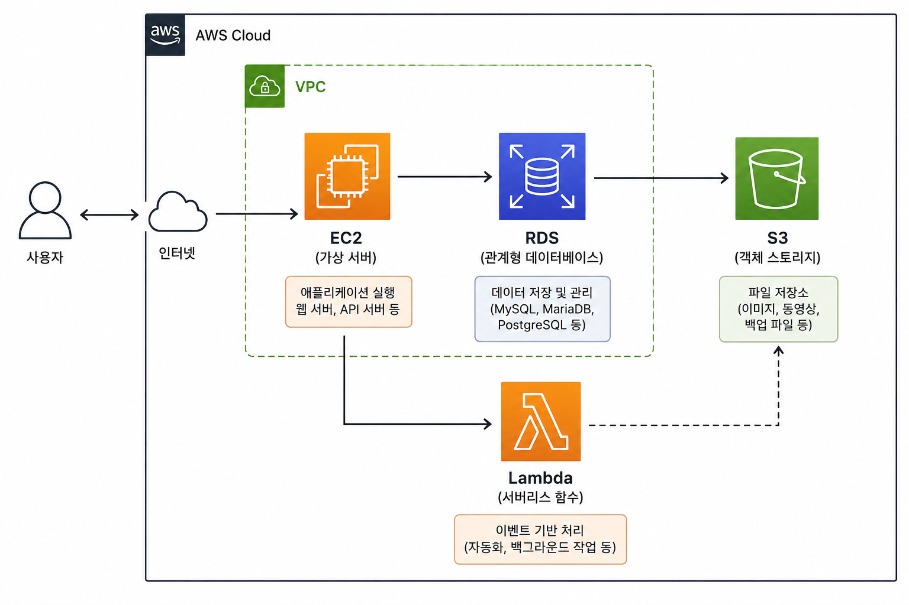
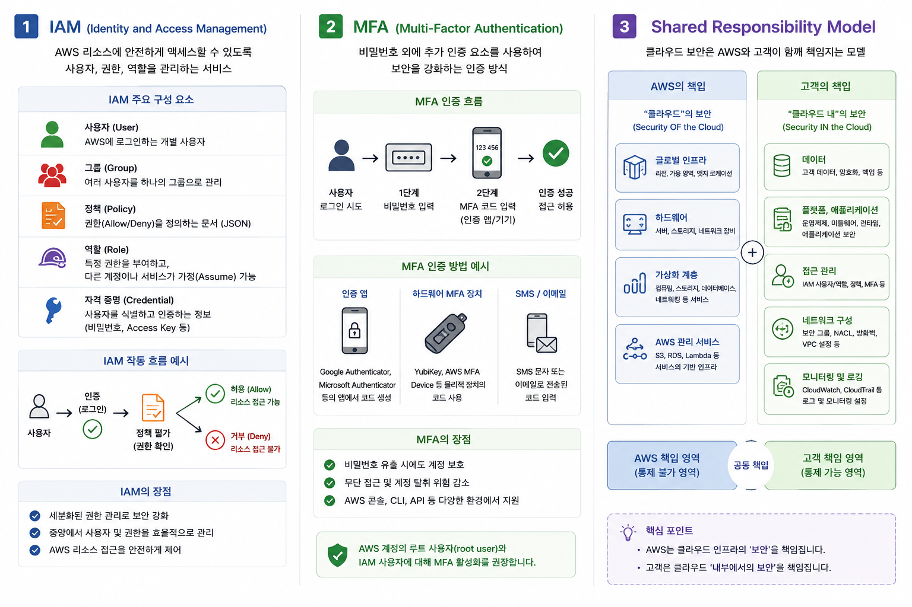
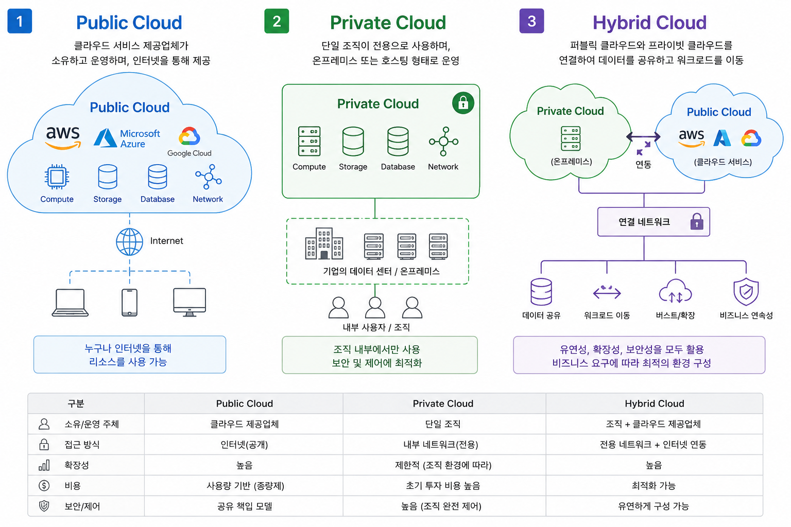
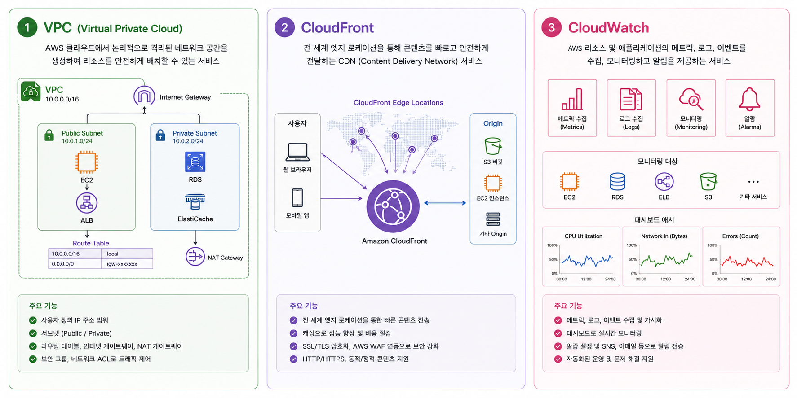

# AWS CCP 시험 개요

*(AWS Certified Cloud Practitioner - CLF-C02 기준)*

AWS 자격증 중 가장 기초 단계인 **AWS Certified Cloud Practitioner(CCP)** 시험에 대해 알아보겠습니다.

이 강의는 **클라우드를 처음 접하는 분들**을 대상으로 설명하겠습니다.

---

# 1. AWS CCP란 무엇인가?

AWS CCP는 **Amazon Web Services(AWS)가 제공하는 입문 수준의 클라우드 자격증**입니다.

쉽게 말하면,

> "AWS 클라우드가 무엇인지 이해하고,
> AWS 서비스를 업무에 어떻게 활용하는지 설명할 수 있는 사람"

을 인증하는 시험입니다.

개발자만을 위한 시험은 아닙니다.

다음과 같은 사람들에게 적합합니다.

* 개발자
* 시스템 관리자
* 네트워크 엔지니어
* 보안 담당자
* 기획자
* 데이터 분석가
* IT 비전공자
* 대학생

---

# 2. 왜 AWS CCP를 공부해야 할까?

현재 많은 기업들이 자체 서버 대신 클라우드를 사용합니다.

예를 들어,

과거 방식

```text
회사
 ├── 서버 구매
 ├── 네트워크 구축
 └── 전산실 운영
```

현재 방식

```text
회사
   │
   ▼
AWS Cloud
 ├── 서버 임대
 ├── 데이터베이스 사용
 ├── AI 서비스 사용
 └── 스토리지 사용
```

대표 기업 사례

* Netflix
* 삼성전자
* LG CNS
* 쿠팡
* 토스

등 많은 기업이 AWS 서비스를 활용하고 있습니다.

---

# 3. AWS CCP 시험 정보

| 항목      | 내용                             |
| --------- | -------------------------------- |
| 시험명    | AWS Certified Cloud Practitioner |
| 시험코드  | CLF-C02                          |
| 시험시간  | 90분                             |
| 문항 수   | 65문항                           |
| 합격점수  | 700점 이상                       |
| 배점 방식 | 100~1000점 환산                  |
| 시험언어  | 한국어 가능                      |
| 응시료    | 약 100 USD                       |
| 시험방식  | 온라인 또는 시험센터             |
| 유효기간  | 3년                              |

---

# 4. 시험에서 평가하는 영역

AWS CCP는 크게 4개 영역을 평가합니다.

1. 클라우드 개념
2. 보안 및 규정 준수
3. 클라우드 기술 및 서비스
4. 비용 및 지원 서비스

---

## Domain 1 : 클라우드 개념 (24%)

### 학습 내용

클라우드란 무엇인가?

왜 기업이 사용하는가?

---

### 알아야 하는 내용

#### On-Premise

회사 안에 서버 설치

```text
회사 전산실

[Server]
[Storage]
[Switch]
```

장점

* 직접 관리 가능

단점

* 초기 비용 높음
* 유지보수 부담

---

#### Cloud

```text
AWS 데이터센터

EC2
RDS
S3
Lambda
```



필요할 때만 사용

장점

* 빠른 구축
* 확장성 우수
* 비용 절감

---

### 클라우드 종류

1. Public Cloud
2. Private Cloud
3. Hybrid Cloud

#### 1. Public Cloud

예: AWS

#### 2. Private Cloud

회사 내부 클라우드

#### 3. Hybrid Cloud

Public Cloud + 회사 내부 클라우드 = 혼합형

예시

은행

```text
고객정보
     │
Private Cloud

일반 웹서비스
     │
AWS
```

---

## Domain 2 : 보안 및 규정 준수 (30%)

가장 비중이 높습니다.

### 반드시 알아야 하는 서비스

### IAM

사용자 권한 관리

예시

학생

```text
학생A
    │
IAM User
```

권한

* EC2 사용 가능
* S3 읽기만 가능

---

### MFA

2단계 인증

```text
ID/PW

+

휴대폰 OTP
```

---

### Shared Responsibility Model

시험 단골 문제입니다.

AWS가 책임지는 부분

```text
데이터센터
하드웨어
네트워크
가상화
```

고객 책임

```text
IAM 설정

S3 권한

데이터 암호화

OS 패치
```



많이 출제됩니다.

---

## Domain 3 : 클라우드 기술 및 서비스 (34%)

시험에서 가장 많은 문제가 나옵니다.

---

### 대표 서비스

### EC2

가상 서버

예시

```text
웹서버

Apache

Nginx

SpringBoot
```

---

### S3

객체 스토리지

사진

영상

백업

저장 가능

특징

무제한 확장

99.999999999% 내구성

---

### RDS

관리형 DB

지원

MySQL

MariaDB

PostgreSQL

Oracle

---

### Lambda

서버 없이 실행

```text
사용자 업로드

↓

Lambda 실행

↓

이미지 변환
```



---

### VPC

AWS 내부 네트워크

```text
VPC

├─ Public Subnet
├─ Private Subnet
```

---

### CloudFront

CDN

전 세계 캐싱

---

### CloudWatch

모니터링

CPU를 모니터링 합니다

메모리를 모니터링 합니다

로그를 확인합니다



---

## Domain 4 : 비용 및 지원 서비스 (12%)

### Pay As You Go

사용한 만큼 비용 지불

---

### Reserved Instance

장기 계약시 할인 가능

---

### Savings Plans

유연한 할인

---

### AWS Support

Basic

Developer

Business

Enterprise

---

# 5. 시험 문제는 어떻게 나올까?

### 예제 1

> AWS에서 가상 서버 서비스를 제공하는 것은?

① S3

② RDS

③ EC2

④ Lambda

정답

③ EC2

---

### 예제 2

> AWS Shared Responsibility Model에서 고객의 책임은?

① 데이터센터 보안

② 서버 랙 관리

③ IAM 권한 설정

④ 네트워크 장비 유지보수

정답

③ IAM 권한 설정

---
