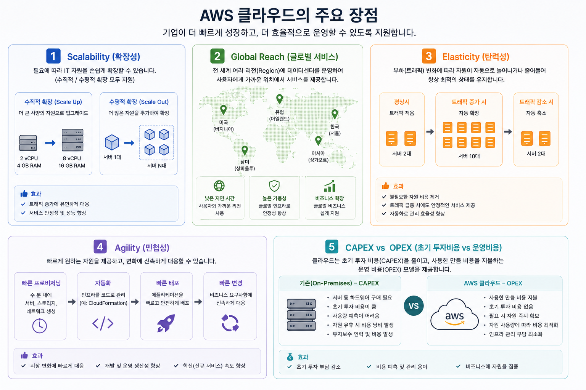

# AWS 클라우드의 장점

AWS CCP 시험에서는 AWS 클라우드의 장점을 이해하는 것이 가장 중요합니다.

이번에는 AWS의 대표적인 장점인 다음 5가지를 살펴보겠습니다.

1. Scalability (확장성)
2. Global Reach (글로벌 서비스)
3. Elasticity (탄력성)
4. Agility (민첩성)
5. CAPEX vs OPEX (초기 투자비용 vs 운영비용)



---

서버를 운영하는 두가지 상황으로 알아보겠습니다.

예를 들어,

**case 1:**

> AI 프로젝트를 위해 서버 1대를 구매한다면

| 항목          | 비용      |
| ------------- | --------- |
| 서버 장비     | 1000만원  |
| 스토리지      | 100만원   |
| 네트워크 장비 | 100만원   |
| 유지보수      | 매년 발생 |

총 1200만원 이상이 필요할 수 있습니다.

**case 2:**

하지만 AWS에서는 서버를 구매하지 않습니다.

필요한 만큼 빌려서 사용합니다.

> 예시

* 시험 기간 : 서버 10대 사용
* 방학 기간 : 서버 1대 사용
* 프로젝트 종료 : 서버 삭제

사용한 만큼만 비용을 지불합니다.

---

> 몇 분 만에 서버 생성 가능

직접 서버를 운영하는 환경에서는 서버를 설치하는데 시간이 오래 걸립니다.

### 기존 방식

```text
서버 주문
↓
배송 대기
↓
랙 설치
↓
운영체제 설치
↓
네트워크 구성
↓
서비스 배포

약 2주~2개월 소요
```

### AWS

```text
AWS Console 접속

↓

EC2 생성

↓

5분 이내 사용 가능
```
---

# 1. Scalability (확장성)

## 개념

**Scalability**는

> **사용자가 증가하더라도 시스템의 성능을 유지하도록 시스템의 크기를 확장하는 능력**입니다.

즉,

> "서비스가 성장하면 컴퓨터도 함께 성장한다."

라고 생각하면 됩니다.

---

## 예시

처음에는 하루 100명이 사용하는 쇼핑몰을 만들었습니다.

```
CPU : 2개
RAM : 4GB
```

하지만 1년 후

```
하루 사용자 100명
↓

10,000명
↓

100,000명
```

사용자가 증가하면 서버도 커져야 합니다.

AWS에서는

```
EC2 작은 서버

↓

중간 서버

↓

대형 서버
```

또는

```
서버 1대

↓

10대

↓

100대
```

로 확장할 수 있습니다.

---

## 두 가지 확장 방법

### Vertical Scaling (Scale Up)

서버의 성능을 높이는 것

```
CPU 2개

↓

CPU 8개
```

```
RAM 4GB

↓

RAM 64GB
```

---

### Horizontal Scaling (Scale Out)

서버의 개수를 늘리는 것

```
서버 1대

↓

5대

↓

20대
```

AWS에서는 Horizontal Scaling을 많이 사용합니다.

---

## 핵심

Scalability는

> **미래의 성장을 대비하는 능력**

입니다.

---

# 2. Global Reach (글로벌 서비스)

## 개념

Global Reach란

> **전 세계 어디서든 서비스를 제공할 수 있는 능력**

입니다.

AWS는 전 세계 여러 지역에 데이터센터를 운영합니다.

학생들이 이해하기 쉽게 말하면

```
한국만 서비스

↓

미국

↓

일본

↓

유럽

↓

전 세계
```

서비스를 확장하는 것입니다.

---

## 예시

서울에만 서버가 있으면

미국 사용자는

```
미국

↓

태평양

↓

서울
```

까지 데이터를 받아야 합니다.

그래서 속도가 느립니다.

---

AWS는

```
서울

도쿄

싱가포르

프랑크푸르트

버지니아

오하이오

시드니
```

등 여러 지역에 서비스를 제공합니다.

가까운 리전에 서버를 배치하면

사용자는 훨씬 빠르게 서비스를 이용할 수 있습니다.

---

## 장점

* 빠른 응답속도
* 장애 분산
* 글로벌 서비스 가능
* 해외 고객 확보

---

# 3. Elasticity (탄력성)

## 개념

Elasticity는

> **필요할 때 자동으로 늘어나고, 필요 없으면 자동으로 줄어드는 능력**

입니다.

여기서 중요한 단어는

> **자동(Auto)**

입니다.

---

## 예시

평상시

```
사용자 100명

↓

서버 2대
```

점심시간

```
사용자 5,000명

↓

자동으로

↓

서버 20대
```

밤

```
사용자 감소

↓

자동으로

↓

서버 2대
```

---

## 왜 좋은가?

필요할 때만 서버를 사용하므로

비용이 절약됩니다.

---

## 대표 서비스

* Auto Scaling
* Elastic Load Balancing

---

# 4. Agility (민첩성)

## 개념

Agility는

> **새로운 서비스를 매우 빠르게 만들고 배포하는 능력**

입니다.

클라우드 이전

```
서버 구매

↓

배송

↓

설치

↓

OS 설치

↓

네트워크 연결

↓

서비스 시작

```

몇 주~몇 달

---

AWS에서는

```
EC2 생성

↓

5분

↓

서비스 시작
```

---

## 예시

게임 회사가 이벤트를 준비합니다.

전통적인 방식

```
서버 주문

↓

2개월 대기
```

AWS

```
EC2 생성

↓

5분
```

---

## 장점

* 빠른 개발
* 빠른 테스트
* 빠른 서비스 출시
* 빠른 장애 대응

---

# 5. CAPEX vs OPEX

AWS 시험에서 자주 나오는 핵심 개념입니다.

---

## CAPEX (Capital Expenditure)

초기 투자 비용

예를 들어

회사에서 직접 서버를 구매합니다.

```
서버

3억원
```

바로 돈을 지불합니다.

```
서버 구매

↓

설치

↓

운영
```

---

### 특징

* 초기 비용이 큼
* 예측이 어려움
* 사용하지 않아도 구매 비용 발생

---

## OPEX (Operational Expenditure)

운영 비용

AWS는

```
필요한 만큼 사용

↓

사용한 만큼 지불
```

입니다.

예를 들어

```
EC2

3시간 사용

↓

3시간만 비용 발생
```

---

### 특징

* 초기 비용 없음
* 사용량만큼 과금
* 예산 관리 쉬움

---

# CAPEX와 OPEX 비교

| CAPEX                     | OPEX                |
| ------------------------- | ------------------- |
| 서버 구매                 | 서버 임대           |
| 초기 비용 큼              | 초기 비용 거의 없음 |
| 유지보수 직접             | AWS가 관리          |
| 사용하지 않아도 비용 발생 | 사용한 만큼만 지불  |
| 확장이 어려움             | 확장이 쉬움         |

---

# Scalability vs Elasticity

AWS 시험에서 가장 많이 헷갈리는 개념입니다.

| Scalability                            | Elasticity                                     |
| -------------------------------------- | ---------------------------------------------- |
| 시스템을 확장할 수 있는 능력           | 사용량 변화에 따라 자동으로 늘리고 줄이는 능력 |
| 미래 성장을 대비                       | 현재 트래픽 변화에 대응                        |
| 수동 또는 자동 가능                    | 일반적으로 자동으로 수행                       |
| 장기적인 관점                          | 단기적·실시간 관점                             |
| 예: 사용자가 10배 증가해도 서비스 유지 | 예: 점심시간에는 서버 증가, 밤에는 서버 감소   |

### 이해하기 쉬운 예

```
평소 사용자

100명

↓

1년 후

100만 명
```

→ **Scalability**

---

```
오전

100명

↓

점심

5,000명

↓

밤

100명
```

→ **Elasticity**

---

# Agility vs Scalability

| Agility                            | Scalability                       |
| ---------------------------------- | --------------------------------- |
| 서비스를 빠르게 개발·배포하는 능력 | 서비스 규모를 확장하는 능력       |
| 개발 속도 중심                     | 시스템 용량 중심                  |
| 개발자 관점                        | 시스템 운영 관점                  |
| 예: 새 웹서비스를 하루 만에 배포  | 예: 사용자 증가에 맞춰 서버를 확장 |

---

# Global Reach vs Scalability

| Global Reach                     | Scalability                           |
| -------------------------------- | ------------------------------------- |
| 서비스 지역을 넓히는 것          | 시스템 용량을 늘리는 것               |
| "어디에서 서비스할 것인가?"      | "얼마나 많은 사용자를 처리할 것인가?" |
| 리전과 가용 영역을 활용          | 서버 성능과 수를 확장                 |
| 예: 한국 서비스 → 미국·유럽 진출 | 예: 사용자 1만 명 → 100만 명 대응     |

---

# Agility vs Elasticity

| Agility                          | Elasticity                            |
| -------------------------------- | ------------------------------------- |
| 빠르게 만들고 배포               | 자동으로 확장·축소                    |
| 개발 속도 향상                   | 운영 효율 향상                        |
| 서비스 출시 시간 단축            | 비용 절감과 성능 유지                 |
| 예: 새로운 기능을 하루 만에 배포 | 예: Auto Scaling으로 트래픽 변화 대응 |

---

# AWS CCP 핵심 개념 한눈에 보기

| 키워드               | 핵심 질문                 | 핵심 의미                           | 대표 예시                   |
| ----------------- | --------------------- | ------------------------------- | ----------------------- |
| **Scalability**   | 더 많은 사용자를 처리할 수 있는가?  | 시스템 규모를 확장하는 능력                 | 서버 1대 → 100대            |
| **Elasticity**    | 사용량 변화에 자동으로 대응하는가?   | 자동 확장·축소                        | 점심에는 20대, 밤에는 2대        |
| **Agility**       | 서비스를 얼마나 빨리 만들 수 있는가? | 개발과 배포의 민첩성                     | EC2를 몇 분 만에 생성하여 서비스 시작 |
| **Global Reach**  | 어디에서 서비스를 제공할 것인가?    | 전 세계 사용자에게 빠르게 서비스 제공           | 서울, 도쿄, 미국 리전에 배포       |
| **CAPEX vs OPEX** | 비용을 어떻게 지불할 것인가?      | 초기 투자(CAPEX) 대신 사용량 기반 과금(OPEX) | 서버 구매 대신 필요한 시간만 EC2 사용 |

---

# AWS CCP 시험 암기 포인트

| 키워드               | 한 줄 암기                          |
| ----------------- | ------------------------------- |
| **Scalability**   | **성장을 대비한 확장 능력**               |
| **Elasticity**    | **트래픽 변화에 맞춘 자동 확장·축소**         |
| **Agility**       | **빠르게 만들고 빠르게 배포하는 능력**         |
| **Global Reach**  | **전 세계 어디서나 서비스를 제공하는 능력**      |
| **CAPEX vs OPEX** | **초기 투자 대신 사용한 만큼 비용을 지불하는 모델** |

> **시험 팁:** AWS CCP에서는 **Scalability**와 **Elasticity**의 차이를 묻는 문제가 매우 자주 출제됩니다. 핵심은 **Scalability는 장기적인 성장에 대비한 확장성**, **Elasticity는 실시간 트래픽 변화에 대응하는 자동 탄력성**이라는 점을 구분하는 것입니다. 또한 **Agility는 개발 속도**, **Global Reach는 서비스 범위**, **CAPEX vs OPEX는 비용 구조**를 설명하는 개념이라는 점을 함께 기억하면 관련 문제를 쉽게 해결할 수 있습니다.
