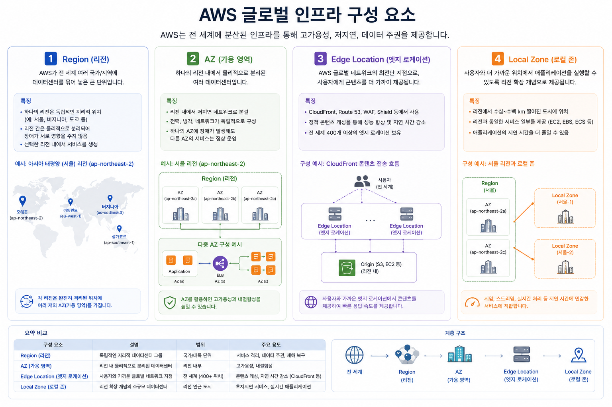

# AWS CCP - AWS 설계 원칙 및 아키텍처 이해

## 주제: AWS Global Infrastructure

AWS Certified Cloud Practitioner(CCP) 시험에서는 **AWS Global Infrastructure(글로벌 인프라)**를 반드시 이해해야 합니다.

학생들이 가장 많이 헷갈리는 것이 **Region, AZ, Edge Location, Local Zone**입니다.

쉽게 말하면 다음과 같습니다.

> **"AWS는 전 세계에 데이터센터를 가지고 있으며, 목적에 따라 서로 다른 역할을 수행한다."**



---

# 1. AWS Global Infrastructure란?

AWS는 전 세계에 수백 개의 데이터센터를 운영하고 있습니다.

이 데이터센터를 하나로 묶어 놓은 것이

> **AWS Global Infrastructure**

입니다.

구성 요소는 크게 다음과 같습니다.

```
AWS Global Infrastructure

├── Region
│      ├── AZ
│      ├── AZ
│      └── AZ
│
├── Region
│      ├── AZ
│      ├── AZ
│      └── AZ
│
├── Edge Location
│
└── Local Zone
```

즉,

AWS Global Infrastructure 안에는

* Region
* AZ
* Edge Location
* Local Zone

이 존재합니다.

---

# 2. Region (리전)

## 정의

Region은

> **AWS 데이터센터들이 모여 있는 하나의 큰 지역**

입니다.

예를 들어

* 서울
* 도쿄
* 싱가포르
* 미국 버지니아
* 런던

모두 하나의 Region입니다.

예시

```
서울 Region

──────────────────────

AZ-a

AZ-b

AZ-c

AZ-d
```

서울 Region 안에는 여러 개의 AZ가 있습니다.

---

## 왜 여러 개의 Region이 있을까?

가장 큰 이유는

### ① 사용자와 가까운 곳에서 서비스하기 위해

한국 사용자는 서울이 가장 빠릅니다.

미국 사용자는 버지니아가 가장 빠릅니다.

거리가 가까울수록

* 응답속도 감소
* 네트워크 지연 감소

됩니다.

---

### ② 국가별 규제

어떤 나라는

> "데이터를 해외에 저장하면 안 된다."

라는 법이 있습니다.

이런 경우 해당 국가 Region을 사용합니다.

---

### ③ 장애 대비

서울 Region이 문제가 생기면

도쿄 Region으로 서비스를 이전할 수 있습니다.

---

# 예시

```
한국 사용자

↓

서울 Region

↓

EC2
RDS
S3
```

---

# 3. AZ (Availability Zone)

학생들이 가장 많이 헷갈리는 개념입니다.

AZ는

> **하나 이상의 독립적인 데이터센터**

입니다.

즉,

```
서울 Region

├── AZ-a
├── AZ-b
├── AZ-c
└── AZ-d
```

각 AZ는

* 서로 다른 건물
* 서로 다른 전력
* 서로 다른 네트워크

를 사용합니다.

---

## 왜 AZ가 여러 개 있을까?

장애 대비입니다.

예를 들어

AZ-a에 장애가 발생해도

AZ-b는 정상입니다.

---

## 예시

```
서울 Region

AZ-a
   EC2

AZ-b
   EC2

로드밸런서

↓

사용자는 장애를 모름
```

이것이

High Availability(고가용성)입니다.

---

# 시험 포인트

> 하나의 AZ는 장애가 발생할 수 있다.

따라서

EC2를 여러 AZ에 배치해야 한다.

---

# 4. Edge Location

Edge Location은

> **콘텐츠를 사용자 가까이에 저장하는 작은 거점**

입니다.

대표 서비스

* CloudFront(CDN)
* Route 53
* AWS WAF
* AWS Shield

---

## 왜 필요할까?

예를 들어

웹사이트 이미지가 서울에만 저장되어 있다면

미국 사용자는 느립니다.

```
미국

↓

서울

↓

이미지 다운로드
```

그래서

미국 Edge Location에도 이미지를 복사합니다.

```
미국 사용자

↓

미국 Edge

↓

이미지 제공
```

엄청 빨라집니다.

---

# 예시

```
원본

서울 S3

↓

CloudFront

↓

Edge Location

↓

한국
일본
미국
유럽

사용자는 가까운 곳에서 다운로드
```

---

# 특징

* 캐시 저장
* CDN
* 정적 콘텐츠
* 빠른 응답

---

# 5. Local Zone

Local Zone은

> **특정 도시에서 초저지연(Low Latency)을 제공하기 위한 AWS 확장 영역**

입니다.

Region보다 사용자와 훨씬 가깝습니다.

---

## 왜 만들었을까?

예를 들어

서울 Region이 있다고 가정합니다.

하지만

게임회사는

```
실시간 게임

지연

1~2ms

필요
```

이런 경우

Local Zone을 사용합니다.

---

## 사용 사례

* 게임
* 영상 편집
* AR
* VR
* 실시간 렌더링
* 금융 거래
* 방송

---

## 특징

Local Zone은

Region과 연결되어 있지만

도시 가까이에 존재합니다.

```
서울 Region

↓

Local Zone

↓

사용자
```

---

# Region vs AZ

| 항목 | Region       | AZ                     |
| ---- | ------------ | ---------------------- |
| 의미 | 큰 지역      | 독립 데이터센터        |
| 구성 | 여러 AZ 포함 | 하나 이상의 데이터센터 |
| 목적 | 지역 분산    | 고가용성               |
| 예   | 서울, 도쿄   | Seoul AZ-a             |

---

# AZ vs Edge Location

| 항목         | AZ          | Edge Location |
| ------------ | ----------- | ------------- |
| 역할         | 서비스 실행 | 콘텐츠 캐싱   |
| EC2 가능     | O           | X             |
| RDS 가능     | O           | X             |
| CloudFront   | X           | O             |
| 데이터 저장  | 실제 데이터 | 캐시 데이터   |

---

# Region vs Local Zone

| 항목        | Region               | Local Zone           |
| ----------- | -------------------- | -------------------- |
| 크기        | 넓음                 | 도시 단위            |
| 서비스 종류 | 거의 모든 AWS 서비스 | 일부 서비스 제공     |
| 목적        | 일반 클라우드 서비스 | 초저지연 서비스      |
| 거리        | 도시 또는 국가 단위  | 사용자와 매우 가까움 |

---

# 전체 관계

```
                    AWS Global Infrastructure

                          │
      ┌───────────────────┼────────────────────┐
      │                   │                    │
   Region            Edge Location        Local Zone
      │
      │
 ┌────┴─────┐
 │          │
AZ-a      AZ-b
 │          │
EC2       EC2
RDS       RDS
```

---

# 예시 시나리오

온라인 게임 서비스를 구축한다고 가정해 보겠습니다.

```
한국 사용자

↓

Edge Location
(게임 패치 파일 다운로드)

↓

서울 Region

↓

AZ-a
게임 서버

AZ-b
게임 서버

↓

RDS
```

* **Region**: 게임 서버와 데이터베이스를 운영하는 주요 위치
* **AZ**: 서버를 여러 AZ에 배치하여 장애 발생 시에도 서비스 지속
* **Edge Location**: 게임 설치 파일이나 패치 파일을 사용자 가까이에서 빠르게 제공
* **Local Zone**: 실시간 게임과 같이 매우 낮은 지연 시간이 필요한 경우 사용자와 가까운 위치에서 게임 서버를 실행

---

# AWS CCP 시험 핵심 암기 포인트

| 키워드                           | 한 줄 요약                                     |
| ----------------------------- | ------------------------------------------ |
| **AWS Global Infrastructure** | AWS가 전 세계에 구축한 클라우드 인프라 전체                 |
| **Region**                    | 여러 개의 AZ를 포함하는 지리적으로 분리된 서비스 영역            |
| **AZ (Availability Zone)**    | 독립적인 전력·네트워크를 갖춘 하나 이상의 데이터센터로, 고가용성을 제공   |
| **Edge Location**             | 콘텐츠를 캐시하여 사용자에게 빠르게 전달하는 CDN 거점            |
| **Local Zone**                | 특정 도시에서 초저지연 워크로드를 지원하기 위해 Region을 확장한 인프라 |

## 시험에서 자주 나오는 비교 포인트

| 질문                                          | 정답                                |
| ------------------------------------------------------------- | --------------------------------- |
| 애플리케이션의 **고가용성(High Availability)** 을 높이려면?   | 여러 **AZ**에 리소스를 배치한다.             |
| 사용자에게 **정적 콘텐츠를 빠르게 제공**하려면?               | **Edge Location**과 CDN 서비스를 사용한다. |
| 여러 국가의 사용자를 대상으로 서비스를 운영하려면?            | 여러 **Region**을 활용한다.              |
| 실시간 게임, AR/VR처럼 **매우 낮은 지연 시간**이 필요한 경우? | **Local Zone**을 활용한다.             |
| AWS 인프라 전체를 의미하는 용어는?                       | **AWS Global Infrastructure**     |

### 기억하기 쉬운 비유

* **AWS Global Infrastructure** = 전 세계에 있는 모든 AWS 시설
* **Region** = 하나의 **도시(예: 서울)**에 있는 AWS 캠퍼스
* **AZ** = 캠퍼스 안의 **서로 독립된 건물들**
* **Edge Location** = 고객 가까이에 있는 **택배 물류창고**(캐시)
* **Local Zone** = 본 캠퍼스에서 확장된 **도심 분점**(초저지연 서비스)

이 비유만 기억해도 시험에서 각 구성 요소의 역할과 차이를 구분하는 데 큰 도움이 됩니다.
