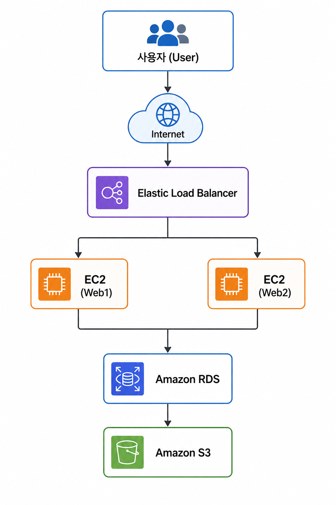
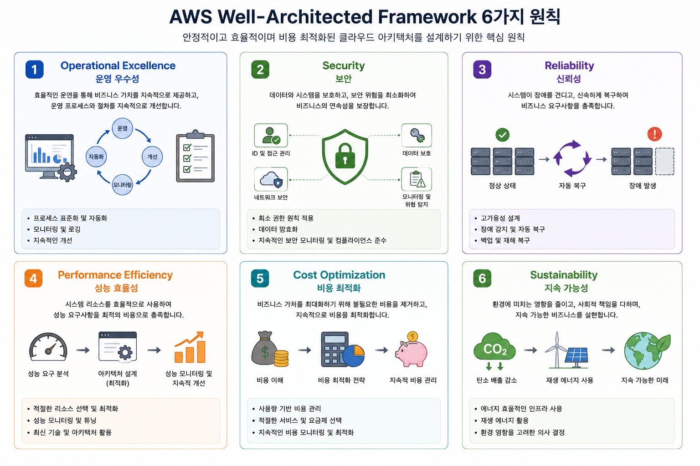

# 제1장. AWS Well-Architected Framework 개요

---

# 학습 목표(Learning Objectives)

이 장을 학습하면 다음 내용을 이해할 수 있습니다.

* 클라우드 아키텍처가 무엇인지 설명할 수 있다.
* AWS Well-Architected Framework의 개념을 이해할 수 있다.
* AWS가 Well-Architected Framework를 만든 이유를 설명할 수 있다.
* Well-Architected Framework의 6가지 핵심 설계 원칙(Pillars)을 이해할 수 있다.
* AWS CCP 시험에서 자주 출제되는 Well-Architected Framework 관련 내용을 설명할 수 있다.

---

# 1.1 클라우드 아키텍처(Cloud Architecture)란?

먼저 "아키텍처(Architecture)"라는 단어부터 이해해 보겠습니다.

아키텍처란 **시스템을 어떻게 구성하고 설계할 것인지에 대한 전체적인 구조와 설계 방식**을 의미합니다.

예를 들어 집을 짓는다고 생각해 보겠습니다.

집을 지을 때는 바로 벽돌을 쌓지 않습니다.

먼저 다음과 같은 설계를 합니다.

* 방은 몇 개로 만들 것인가?
* 화장실은 어디에 배치할 것인가?
* 전기와 수도는 어떻게 연결할 것인가?
* 지진이나 태풍에도 안전한 구조인가?

이러한 설계도를 **건축 아키텍처(Architecture)**라고 합니다.

IT 시스템도 마찬가지입니다.

웹사이트나 모바일 앱, 쇼핑몰, 게임 서버 등을 구축할 때도 단순히 서버를 여러 대 설치하는 것이 아니라, 전체 시스템을 어떻게 구성할 것인지 먼저 설계해야 합니다.

이를 **클라우드 아키텍처(Cloud Architecture)**라고 합니다.

예를 들어 온라인 쇼핑몰을 AWS에 구축한다고 가정해 보겠습니다.



이 그림은 하나의 간단한 클라우드 아키텍처입니다.

각 서비스는 다음과 같은 역할을 합니다.

| 구성 요소     | 역할                           |
| ------------- | ------------------------------ |
| Load Balancer | 사용자 요청을 여러 서버로 분산 |
| EC2           | 웹 애플리케이션 실행           |
| Amazon RDS    | 데이터베이스 저장              |
| Amazon S3     | 이미지 및 파일 저장            |

즉, 아키텍처는 **서비스를 어떤 구조로 배치할 것인지 설계하는 것**입니다.

---

# 1.2 왜 좋은 아키텍처가 필요한가?

클라우드에서는 서버를 쉽게 만들 수 있습니다.

그러나 서버를 많이 만든다고 해서 좋은 시스템이 되는 것은 아닙니다.

다음 두 가지 사례를 비교해 보겠습니다.

## 사례 1. 잘못된 설계

한 스타트업이 EC2 인스턴스 한 대에 모든 서비스를 설치했습니다.

```text
EC2

├─ Web Server
├─ Database
├─ File Storage
├─ Application
└─ Cache
```

처음에는 문제가 없었습니다.

하지만 사용자가 늘어나자 다음과 같은 문제가 발생했습니다.

* 서버 속도가 느려짐
* 메모리 부족
* CPU 사용률 100%
* 서버 장애 시 전체 서비스 중단
* 백업 어려움
* 유지보수 어려움

---

## 사례 2. AWS 권장 설계

AWS에서는 역할을 분리하여 설계하는 것을 권장합니다.


이 구조에서는 다음과 같은 장점이 있습니다.

* 서버 하나가 고장 나도 서비스 지속
* 데이터베이스는 별도로 관리
* 파일 저장소도 분리
* 서버를 쉽게 추가 가능
* 유지보수 용이

이처럼 **올바른 아키텍처는 서비스의 안정성과 확장성을 크게 향상시킵니다.**

---

# 1.3 AWS는 왜 Well-Architected Framework를 만들었을까?

AWS는 전 세계 수백만 고객의 시스템을 운영하면서 다양한 성공 사례와 실패 사례를 분석했습니다.

예를 들어 다음과 같은 공통적인 문제를 발견했습니다.

* 서버를 하나만 구성하여 장애 발생 시 서비스가 중단됨
* 백업이 없어 데이터가 손실됨
* 보안 설정이 미흡하여 정보가 유출됨
* 사용하지 않는 리소스를 계속 운영하여 비용이 증가함

이러한 문제를 줄이기 위해 AWS는 **모범 사례(Best Practices)**를 정리하였습니다.

이것이 바로 **AWS Well-Architected Framework**입니다.

즉, Well-Architected Framework는 "AWS가 권장하는 좋은 클라우드 설계 기준"이라고 이해하면 됩니다.

---

# 1.4 AWS Well-Architected Framework란?

AWS Well-Architected Framework는 **안전하고, 효율적이며, 안정적인 클라우드 시스템을 설계하기 위한 모범 사례 집합**입니다.

쉽게 말하면, 건축에서 건축법과 설계 기준이 있듯이, AWS에서는 클라우드 시스템을 설계할 때 지켜야 할 원칙을 정리한 것입니다.

AWS는 다음과 같이 정의합니다.

> "클라우드 아키텍처를 평가하고 개선하기 위한 모범 사례 프레임워크"

이 프레임워크를 활용하면 현재 구축한 시스템을 점검하고, 부족한 부분을 개선할 수 있습니다.

---

# 1.5 Well-Architected Framework의 핵심 목표

AWS는 다음과 같은 목표를 달성하기 위해 Well-Architected Framework를 제공합니다.



## ① 운영 자동화(Operational Excellence)

사람이 반복적으로 수행하는 작업은 자동화하는 것이 좋습니다.

예를 들어 서버 생성, 배포, 백업 등을 자동화하면 오류를 줄이고 운영 효율을 높일 수 있습니다.

---

## ② 보안(Security)

클라우드에는 중요한 고객 정보가 저장됩니다.

따라서 다음과 같은 보안이 필요합니다.

* 접근 권한 관리
* 데이터 암호화
* 사용자 인증
* 로그 기록

## ③ 안정성(Reliability)

서비스가 장애 상황에서도 계속 동작해야 합니다.

예를 들어 은행 시스템은 24시간 운영되어야 합니다.

서버 한 대가 고장 났다고 모든 서비스가 중단되어서는 안 됩니다.

---

## ④ 성능(Performance)

사용자가 많아져도 서비스가 느려지지 않아야 합니다.

예를 들어 콘서트 티켓 예매 사이트는 특정 시간에 수십만 명이 동시에 접속할 수 있습니다.

이때도 빠른 응답 속도를 유지해야 합니다.

---

## ⑤ 비용 절감(Cost Optimization)

클라우드는 사용한 만큼 비용을 지불합니다.

따라서 필요 이상의 리소스를 사용하면 비용이 증가합니다.

AWS는 적절한 리소스를 선택하고 자동으로 확장하거나 축소하는 설계를 권장합니다.

---

## ⑥ 지속 가능성(Sustainability)

최근에는 친환경 IT가 중요해졌습니다.

필요 이상의 서버를 운영하면 전력 소비가 증가하고 탄소 배출도 늘어납니다.

AWS는 효율적인 리소스 사용을 통해 환경 보호에도 기여할 수 있도록 설계를 권장합니다.

---

# 1.6 Well-Architected Framework의 6가지 Pillars

Well-Architected Framework는 6개의 핵심 설계 원칙(Pillar)으로 구성됩니다.

```text
              AWS Well-Architected Framework

                      [Cloud Architecture]

      ┌──────────────────────────────────────────┐
      │ 1. Operational Excellence                │
      │ 2. Security                              │
      │ 3. Reliability                           │
      │ 4. Performance Efficiency                │
      │ 5. Cost Optimization                     │
      │ 6. Sustainability                        │
      └──────────────────────────────────────────┘
```

각 Pillar의 의미를 간단히 살펴보겠습니다.

| Pillar                 | 핵심 질문                                | 쉽게 이해하기           |
| ---------------------- | ---------------------------------------- | ----------------------- |
| Operational Excellence | 운영을 효율적으로 하고 있는가?           | 자동화와 지속적인 개선  |
| Security               | 안전한 시스템인가?                       | 데이터와 시스템 보호    |
| Reliability            | 장애가 발생해도 계속 서비스할 수 있는가? | 안정성과 복구 능력      |
| Performance Efficiency | 필요한 성능을 효율적으로 제공하는가?     | 성능과 확장성           |
| Cost Optimization      | 비용을 낭비하지 않는가?                  | 비용 절감과 효율        |
| Sustainability         | 친환경적으로 운영하고 있는가?            | 에너지 효율과 탄소 절감 |

이 여섯 가지는 서로 독립적인 것이 아니라, 하나의 균형 잡힌 아키텍처를 구성하는 요소입니다.

---

# 1.7 Well-Architected Framework를 실제 프로젝트에서 어떻게 활용할까?

프로젝트를 진행할 때는 다음과 같은 질문을 스스로에게 던져야 합니다.

* 운영 자동화는 충분한가?
* 보안은 적절하게 구성되었는가?
* 장애가 발생해도 서비스를 계속 제공할 수 있는가?
* 성능은 충분한가?
* 비용은 효율적인가?
* 불필요한 리소스를 사용하고 있지는 않은가?

이러한 질문에 답하면서 시스템을 개선하는 과정이 바로 Well-Architected Framework를 활용하는 방법입니다.

---

# 1.8 AWS CCP 시험에서 자주 출제되는 포인트

AWS CCP 시험에서는 Well-Architected Framework의 개념과 각 Pillar의 역할을 이해하는 문제가 자주 출제됩니다.

대표적인 유형은 다음과 같습니다.

### 예제 1

**문제:** 반복적인 서버 배포 작업을 자동화하려고 한다. 가장 관련 있는 Pillar는 무엇인가?

* A. Security
* B. Reliability
* C. Operational Excellence
* D. Sustainability

**정답:** C

---

### 예제 2

**문제:** 장애가 발생해도 서비스를 계속 운영할 수 있도록 Multi-AZ를 구성하였다. 가장 관련 있는 Pillar는 무엇인가?

**정답:** Reliability

---

### 예제 3

**문제:** 사용하지 않는 EC2 인스턴스를 종료하여 비용을 절감하였다. 가장 관련 있는 Pillar는 무엇인가?

**정답:** Cost Optimization

---

# 1.9 핵심 정리

이 장에서는 AWS Well-Architected Framework의 기본 개념과 필요성을 학습했습니다.

핵심 내용을 다시 정리하면 다음과 같습니다.

* **클라우드 아키텍처**는 시스템을 효율적으로 설계하는 전체 구조를 의미합니다.
* **AWS Well-Architected Framework**는 AWS가 제시하는 클라우드 설계 모범 사례(Best Practice)입니다.
* 좋은 아키텍처는 안정성, 보안, 성능, 비용, 운영 효율, 지속 가능성을 모두 고려해야 합니다.
* Well-Architected Framework는 다음의 **6개 Pillar**로 구성됩니다.

  1. Operational Excellence
  2. Security
  3. Reliability
  4. Performance Efficiency
  5. Cost Optimization
  6. Sustainability

* AWS CCP 시험에서는 **각 Pillar의 목적과 대표적인 AWS 서비스 및 적용 사례를 구분하는 문제가 자주 출제**됩니다.

---

## AWS CCP 암기 포인트

| 키워드                         | 반드시 기억할 내용                                                                                                      |
| ------------------------------ | ----------------------------------------------------------------------------------------------------------------------- |
| AWS Well-Architected Framework | AWS가 제공하는 클라우드 설계 모범 사례(Best Practices)                                                                  |
| 목적                           | 안전하고 효율적이며 안정적인 클라우드 아키텍처 설계                                                                     |
| 구성                           | 6개의 Pillars(Operational Excellence, Security, Reliability, Performance Efficiency, Cost Optimization, Sustainability) |
| 시험 핵심                      | 각 Pillar의 목적과 대표 사례를 구분할 수 있어야 함                                                                      |

### 암기법

* **운영(Operational Excellence)** → 자동화
* **보안(Security)** → 보호
* **신뢰성(Reliability)** → 장애 대응
* **성능(Performance Efficiency)** → 효율적인 성능
* **비용(Cost Optimization)** → 절감
* **지속 가능성(Sustainability)** → 친환경

이 여섯 가지 키워드만 정확히 연결할 수 있어도 AWS CCP의 Well-Architected Framework 관련 문제를 푸는 데 큰 도움이 됩니다.
