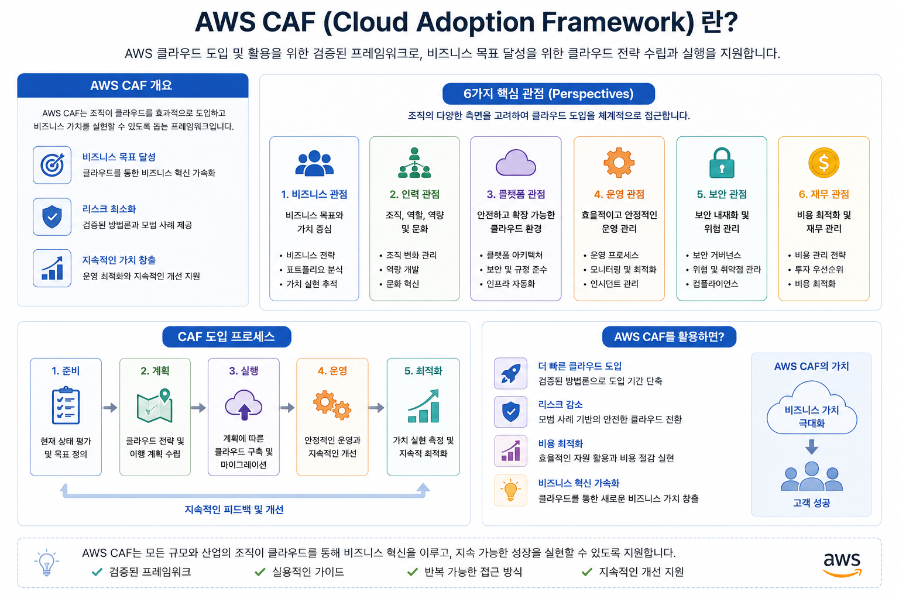
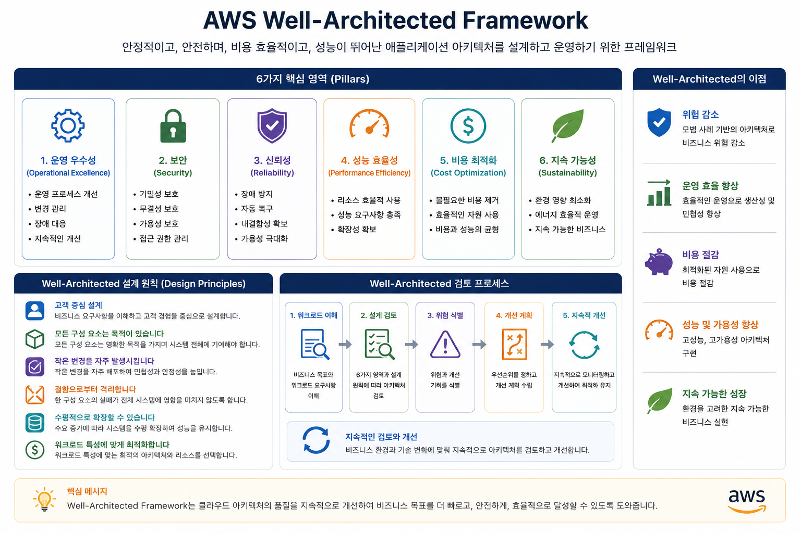

# AWS CAF (Cloud Adoption Framework) 소개

---

# 1. AWS CAF란?

AWS CAF(Cloud Adoption Framework)는 기업이 클라우드를 성공적으로 도입할 수 있도록 지원하는 **전사적(Enterprise) 클라우드 도입 프레임워크**입니다.

쉽게 말하면,

> **"기업이 AWS를 도입하기 전에 무엇을 준비해야 하는지를 알려주는 가이드"**

입니다.

많은 사람들이 AWS 도입을 단순히 서버를 AWS로 이전하는 것이라고 생각합니다.

하지만 실제로는 다음과 같은 요소들도 함께 준비해야 합니다.

* 조직(Organization)
* 인력(People)
* 기술(Technology)
* 운영(Operation)
* 보안(Security)
* 비용(Finance)

즉,

AWS CAF는

**기술뿐만 아니라 조직 전체가 클라우드를 성공적으로 도입하도록 도와주는 프레임워크**입니다.

---

# 2. AWS CAF가 필요한 이유

예를 들어 한 회사가 AWS로 이전한다고 가정해 보겠습니다.

많은 사람들이 다음과 같이 생각합니다.

```text
회사

↓

AWS

↓

끝
```

하지만 실제 프로젝트는 훨씬 복잡합니다.

```text
현재 시스템 분석

↓

비즈니스 목표 분석

↓

조직 준비

↓

교육

↓

보안 정책

↓

Migration

↓

AWS 운영

↓

지속적인 개선
```

즉,

클라우드 도입은

**IT 프로젝트가 아니라 기업의 디지털 전환(Digital Transformation)** 입니다.

그래서 AWS는 CAF를 제공합니다.

---

# 3. AWS CAF의 목표

AWS CAF는 다음과 같은 질문에 답하도록 설계되었습니다.

* 왜 클라우드를 도입하는가?
* 어떤 조직이 필요한가?
* 어떤 기술을 사용할 것인가?
* 비용은 어떻게 관리할 것인가?
* 운영 조직은 어떻게 바뀌어야 하는가?
* 보안은 어떻게 관리할 것인가?

---

# 4. AWS CAF의 전체 구조

AWS CAF는 **6개의 관점(Perspectives)** 으로 구성됩니다.

```text
                AWS CAF

                    │

 ┌───────────────────────────────────────┐
 │ Business (비즈니스 관점)               │
 │ People    (인력 관점)                  │
 │ Governance (거버넌스 관점)             │
 │ Platform                              │
 │ Security                              │
 │ Operations                            │
 └───────────────────────────────────────┘
```

AWS는 이 여섯 가지 관점을 모두 고려해야 성공적인 클라우드 도입이 가능하다고 설명합니다.

---

# 5. AWS CAF의 6가지 관점

## ① Business Perspective (비즈니스 관점)

### 목적

클라우드를 도입하여 **비즈니스 가치를 창출**하는 것입니다.

즉,

> "왜 AWS를 도입하는가?"

를 결정합니다.

예를 들어

* 비용 절감
* 서비스 출시 시간 단축(Time to Market)
* 글로벌 시장 진출
* 신규 서비스 개발

등이 있습니다.

### 주요 이해관계자

* CEO
* CFO
* 사업부장

### 핵심 질문

* 투자 효과(ROI)는?
* 경쟁력이 향상되는가?
* 고객 만족도가 증가하는가?

---

## ② People Perspective (인력 관점)

### 목적

클라우드를 운영할 사람을 준비하는 것입니다.

AWS를 도입한다고 해서 기존 조직이 그대로 운영되는 것은 아닙니다.

예를 들어

기존에는

```text
서버 관리자

↓

네트워크 관리자

↓

DB 관리자
```

였다면

클라우드에서는

```text
Cloud Engineer

↓

DevOps Engineer

↓

Cloud Architect
```

와 같이 역할이 변화합니다.

### 주요 활동

* AWS 교육
* 조직 변경
* 역할 정의
* 기술 향상

---

## ③ Governance Perspective (거버넌스 관점)

### 목적

AWS를 어떻게 운영(관리)할 것인지 결정하는 것입니다.
조직의 정책(Policy), 규칙(Rule), 표준(Standard), 절차(Process)를 정하고, 모든 사용자가 이를 따르도록 관리하는 체계입니다.

예를 들어

* 비용 승인
* IAM 정책
* 태그 정책
* 표준 운영 절차

등을 정의합니다.

### 주요 활동

* 비용 관리
* 리소스 표준화
* 규정 준수
* 정책 관리

---

## ④ Platform Perspective (플랫폼 관점)

### 목적

AWS 기술을 설계하고 구축하는 것입니다.

이 관점이 가장 기술적인 영역입니다.

예를 들어

* VPC
* EC2
* RDS
* S3
* EKS
* ECS

등을 설계합니다.

### 주요 활동

* 네트워크 설계
* 시스템 구축
* Migration
* Infrastructure as Code

---

## ⑤ Security Perspective (보안 관점)

### 목적

AWS 환경을 안전하게 운영하는 것입니다.

대표적인 서비스

* IAM
* KMS
* WAF
* Shield
* GuardDuty

### 주요 활동

* 암호화
* 접근 제어
* 감사
* 위협 탐지

---

## ⑥ Operations Perspective (운영 관점)

### 목적

AWS 환경을 안정적으로 운영하는 것입니다.

예를 들어

* CloudWatch
* Systems Manager
* Backup
* Incident 대응

등을 포함합니다.

### 주요 활동

* 모니터링
* 장애 대응
* 백업
* 운영 자동화

---

# 6. AWS CAF 프로젝트 진행 흐름

실제 프로젝트에서는 다음과 같은 순서로 진행됩니다.

```text
비즈니스 목표

↓

AWS CAF

↓

Migration Assessment

↓

Migration 6R

↓

AWS 구축

↓

Well-Architected Framework

↓

운영
```

CAF는 가장 처음 단계에서 사용됩니다.

## 전체 그림



## 6.1  **AWS CCP에서 가장 중요한 전체 그림(Big Picture)** 입니다

많은 학생들이 AWS 서비스를 하나씩 외우려고 합니다.

* EC2
* S3
* RDS
* IAM
* VPC

하지만 실제 회사에서는 이렇게 접근하지 않습니다.

회사는 **"EC2를 어떻게 사용할까?"** 를 먼저 고민하지 않습니다.

먼저

> **"우리 회사의 비즈니스 목표를 달성하기 위해 AWS를 어떻게 사용할 것인가?"**

를 고민합니다.

그래서 저는 학생들에게 아래와 같은 **프로젝트 스토리**로 설명합니다.

---

## 1단계. 비즈니스 목표(Business Goal)

## 가장 먼저 생각하는 것은 기술이 아닙니다.

많은 학생들이

> "AWS를 사용하려고 합니다."

라고 생각합니다.

하지만 회사에서는

AWS는 목적이 아니라 **수단** 입니다.

가장 먼저 나오는 질문은

> **왜 AWS를 사용하는가?**

입니다.

예를 들어 보겠습니다.

### 사례 1 : 쇼핑몰 회사

현재

```text
사용자 : 하루 5천 명

연말에는 30만 명

서버 자주 다운
```

회사의 목표는

```text
연말에도 서버가 멈추지 않도록 한다.
```

입니다.

AWS는

그 목표를 달성하기 위한 방법입니다.

---

### 사례 2 : 게임 회사

현재

```text
국내 서비스만 운영
```

회사의 목표

```text
일본

미국

유럽

서비스 시작
```

AWS를 사용하는 이유는

글로벌 서비스를 빠르게 시작하기 위해서입니다.

---

### 사례 3 : AI 회사

현재

```text
GPU 서버 부족
```

회사의 목표

```text
AI 모델을 더 빠르게 학습
```

AWS에서는 GPU 인스턴스를 임대하여 해결합니다.

---

즉,

비즈니스 목표는

> **기술보다 먼저 결정되는 사항**

입니다.

---

## 2단계. AWS CAF

비즈니스 목표가 결정되면

이제

> **우리 회사가 AWS를 사용할 준비가 되었는가?**

를 확인합니다.

CAF는

기술을 준비하는 것이 아니라

**회사를 준비시키는 과정**입니다.

---

## 3단계. Migration Assessment

이제

회사의 시스템을 조사합니다.

예를 들어

현재 시스템이

```text
ERP

메일

Oracle DB

파일 서버

홈페이지

AI 서버
```

라고 가정해 보겠습니다.

AWS에서는

각 시스템을 하나씩 분석합니다.

---

## 조사하는 내용

### 서버

```text
CPU

Memory

Disk

OS
```

---

### 데이터베이스

```text
Oracle

MySQL

MS SQL

PostgreSQL
```

---

### 네트워크

```text
대역폭

VPN

Firewall
```

---

### 의존성

예를 들어

```text
ERP

↓

Oracle DB

↓

NAS

↓

백업 서버
```

이 관계를 반드시 파악해야 합니다.

### Assessment에서 확인하는 항목

| 분석 항목      | 설명                           |
| -------------- | ------------------------------ |
| 서버 수        | 몇 대의 서버가 있는가?         |
| CPU 사용률     | 현재 자원 사용량               |
| Memory         | 메모리 사용량                  |
| Storage        | 디스크 사용량                  |
| Network        | 네트워크 트래픽                |
| Dependency     | 어떤 시스템과 연결되어 있는가? |
| 라이선스       | Oracle, Windows 등의 라이선스  |
| 비용           | 현재 운영 비용                 |
| 보안           | 민감 데이터 여부               |

---

## 결과

실제 AWS Migration Assessment에서는 **인벤토리(Inventory) 형태의 분석 보고서**를 작성합니다.

AWS Migration Evaluator나 Discovery Service에서도 이와 유사한 형태의 결과를 제공합니다.

### Migration Assessment 결과 예시

### 1. 전체 시스템 현황

| 분석 항목     | 분석 결과                               | 설명                     |
| ------------- | --------------------------------------- | ------------------------ |
| 총 서버 수    | **120대**                               | 현재 운영 중인 전체 서버 |
| 물리 서버     | 35대                                    | 데이터센터에서 운영      |
| 가상 서버(VM) | 85대                                    | VMware 기반              |
| 운영체제      | Windows 40대 / Linux 80대               | OS 분포                  |
| 데이터베이스  | Oracle 12개 / MySQL 18개 / MS SQL 6개   | 운영 중인 DB             |
| 애플리케이션  | 46개                                    | 업무 시스템 개수         |
| 웹 서버       | 18대                                    | 홈페이지 및 웹 서비스    |
| WAS 서버      | 22대                                    | 애플리케이션 서버        |
| 파일 서버     | 8대                                     | NAS 및 파일 공유         |
| 백업 서버     | 4대                                     | 백업 시스템              |

---

### 2. 서버(Resource) 분석 결과

| 분석 항목       | 평균          | 최대            | 비고                  |
| --------------- | ------------- | --------------- | --------------------- |
| CPU 사용률      | 28%           | 81%             | 대부분 과소 사용      |
| Memory 사용률   | 46%           | 89%             | 일부 서버 증설 필요   |
| Storage 사용률  | 63%           | 94%             | 일부 서버 디스크 부족 |
| Network Traffic | 평균 120 Mbps | 최대 850 Mbps   | 업무 시간 집중        |
| Disk IOPS       | 평균 850 IOPS | 최대 4,200 IOPS | DB 서버 집중          |

> **분석 결과:** CPU 사용률이 평균 28%로 낮아 AWS 이전 시 더 작은 EC2 인스턴스로 비용을 절감할 가능성이 있습니다.

---

### 3. 운영체제(OS) 분석

| 운영체제                 | 서버 수 | 비율 | 이전 권장              |
| ------------------------ | ------- | ---- | ---------------------- |
| Windows Server 2019      | 28대    | 23%  | EC2 Rehost             |
| Windows Server 2016      | 12대    | 10%  | 업그레이드 권장        |
| Ubuntu                   | 35대    | 29%  | EC2 또는 컨테이너      |
| Red Hat Enterprise Linux | 27대    | 23%  | EC2 또는 ECS           |
| CentOS                   | 18대    | 15%  | Amazon Linux 전환 검토 |

---

### 4. 데이터베이스 분석

| 데이터베이스         | 개수 | 용량 | 이전 전략                              |
| -------------------- | ---- | ---- | -------------------------------------- |
| Oracle               | 12개 | 18TB | Amazon RDS 또는 Aurora PostgreSQL 검토 |
| MySQL                | 18개 | 7TB  | Amazon RDS                             |
| Microsoft SQL Server | 6개  | 5TB  | Amazon RDS SQL Server                  |
| PostgreSQL           | 4개  | 2TB  | Amazon RDS PostgreSQL                  |

---

### 5. 스토리지 분석

| 항목         | 분석 결과 | 이전 대상                  |
| -----------  | --------- | -------------------------- |
| 총 저장 용량 | 520TB     | AWS Storage                |
| NAS          | 180TB     | Amazon FSx 또는 Amazon EFS |
| 파일 서버    | 140TB     | Amazon S3                  |
| 데이터베이스 | 120TB     | Amazon RDS                 |
| 백업 데이터  | 80TB      | Amazon S3 Glacier          |

---

### 6. 네트워크 분석

| 분석 항목        | 결과     |
| ---------------- | -------- |
| 인터넷 대역폭    | 2 Gbps   |
| 평균 사용량      | 620 Mbps |
| 최대 사용량      | 1.7 Gbps |
| VPN 연결         | 5개      |
| 외부 시스템 연동 | 18개     |
| 내부 시스템 연동 | 72개     |

---

### 7. Dependency(의존성) 분석

| 시스템   | 연결 대상        | 중요도    | 비고             |
| -------- | ---------------- | --------- | ---------------- |
| ERP      | Oracle DB        | 매우 높음 | 반드시 함께 이전 |
| ERP      | 파일 서버        | 높음      | 데이터 공유      |
| 홈페이지 | MySQL            | 매우 높음 | 실시간 서비스    |
| 그룹웨어 | Active Directory | 매우 높음 | 인증 시스템      |
| AI 서버  | NAS              | 높음      | 학습 데이터 저장 |

---

### 8. 라이선스 분석

| 소프트웨어      | 수량 | 연간 비용 | AWS 이전 시 검토            |
| --------------- | ---- | --------- | --------------------------- |
| Oracle Database | 12개 | 7억 원    | Aurora PostgreSQL 전환 검토 |
| Windows Server  | 40개 | 1억 원    | License Included 검토       |
| Microsoft SQL   | 6개  | 1.5억 원  | Amazon RDS SQL Server       |
| VMware          | 85대 | 2억 원    | EC2 이전 시 절감 가능       |

---

### 9. 운영 비용 분석

| 항목             |     연간 비용 |
| ---------------- | ------------: |
| 서버 유지보수    |        3억 원 |
| 스토리지         |      8천만 원 |
| 네트워크         |      5천만 원 |
| 데이터센터       |        2억 원 |
| 전기 및 냉각     |        1억 원 |
| 라이선스         |       10억 원 |
| 운영 인력        |        6억 원 |
| **총 운영 비용** | **23.3억 원** |

---

### 10. 보안 분석

| 분석 항목          | 결과 | 개선 사항                |
| ------------------ | ---- | ------------------------ |
| 개인정보 포함 DB   | 8개  | 암호화 적용 필요         |
| 민감 데이터 저장소 | 5개  | KMS 적용 권장            |
| Public 서버        | 12대 | WAF 적용 권장            |
| MFA 사용률         | 35%  | 100% 적용 권장           |
| 관리자 계정        | 26개 | 최소 권한 원칙 적용 필요 |
| 암호화 적용률      | 48%  | 저장 데이터 암호화 확대  |

---

### 11. Migration Assessment 최종 요약

| 항목                 | 분석 결과        |
| -------------------- | ---------------: |
| 총 서버              | **120대**        |
| Windows              | **40대**         |
| Linux                | **80대**         |
| Oracle DB            | **12개**         |
| MySQL                | **18개**         |
| 총 저장 용량         | **520TB**        |
| 총 운영 비용         | **연 23.3억 원** |
| 평균 CPU 사용률      | **28%**          |
| 평균 메모리 사용률   | **46%**          |
| 평균 디스크 사용률   | **63%**          |
| Public 서비스        | **12개**         |
| 중요 업무 시스템     | **46개**         |
| 예상 AWS 이전 기간   | **약 9개월**     |
| 예상 비용 절감 효과  | **약 28%**       |

---

## AWS CCP 관점에서 기억해야 할 핵심

Migration Assessment는 단순히 **"현재 서버가 몇 대인지 조사하는 과정"** 이 아닙니다. 기업의 IT 환경을 다각도로 분석하여 **현재 상태(As-Is)** 를 정확히 파악하고, 이를 바탕으로 **어떤 시스템을 어떤 방식(6R)으로 AWS에 이전할지 결정하기 위한 기초 자료를 만드는 과정**입니다.

따라서 Assessment 결과는 다음 단계인 **Migration Strategy(6R)** 의 입력 자료가 되며, AWS 이전 프로젝트의 성공 여부를 좌우하는 매우 중요한 단계라고 이해하면 됩니다.

---

## 4단계. Migration Strategy (6R)

이제 가장 중요한 결정을 합니다.

> **이 시스템을 어떻게 AWS로 옮길 것인가?**

AWS는 대표적으로 **6R 전략**을 제시합니다.

| 전략         | 의미                | 예시                              |
| ------------ | ------------------- | --------------------------------- |
| Rehost       | 그대로 이전         | EC2로 Lift & Shift                |
| Replatform   | 일부 개선           | Oracle → Amazon RDS PostgreSQL    |
| Repurchase   | SaaS로 교체         | 자체 메일 → Microsoft 365         |
| Refactor     | 애플리케이션 재설계 | 모놀리식 → 마이크로서비스         |
| Retire       | 사용 중단           | 더 이상 사용하지 않는 시스템 폐기 |
| Retain       | 당분간 유지         | 규제 등으로 온프레미스 유지       |

모든 시스템을 같은 방식으로 이전하지는 않습니다.

---

## 예시

### ERP

거의 수정 없이

```text
EC2
```

로 이전

↓

**Rehost**

---

### Oracle

Oracle 라이선스 비용이 너무 비쌉니다.

↓

Amazon RDS PostgreSQL로 변경

↓

**Replatform**

---

### 메일 서버

직접 운영 중

↓

Microsoft 365 사용

↓

**Repurchase**

---

### 오래된 프로그램

사용하지 않음

↓

삭제

↓

**Retire**

---

### 공장 시스템

24시간 운영

↓

당분간 유지

↓

**Retain**

---

### 쇼핑몰

MSA로 변경

↓

**Refactor**

---

이 단계가 끝나면

모든 시스템의 이전 전략이 결정됩니다.

---

## 5단계. AWS 구축(Build)

이제 실제 AWS 환경을 구축합니다.

하지만

처음부터 EC2를 생성하지는 않습니다.

먼저

표준 환경을 만듭니다.

이를

**Landing Zone**

이라고 합니다.

---

### 구축 순서

```text
AWS Organization

↓

Account 생성

↓

IAM

↓

VPC

↓

Subnet

↓

Route Table

↓

Internet Gateway

↓

Security Group

↓

CloudTrail

↓

Config

↓

CloudWatch
```

이 과정은

건물을 짓기 전에

기초공사를 하는 것과 같습니다.

---

### 이후 실제 서비스 구축

예를 들어

```text
ALB

↓

EC2 Auto Scaling

↓

RDS Multi-AZ

↓

S3

↓

CloudFront

↓

Route53
```

쇼핑몰이

완성됩니다.

---

## 6단계. Well-Architected Framework

서비스를 구축했다고 끝이 아닙니다.

AWS에서는

다시 질문합니다.

> **현재 구조가 AWS Best Practice를 따르고 있는가?**

---

예를 들어

현재

```text
EC2

20대
```

운영 중입니다.

하지만

분석해보니

```text
Auto Scaling

↓

10대면 충분
```

합니다.

---

또는

```text
S3

암호화 안됨
```

↓

```text
KMS 적용
```

---

또는

```text
RDS

Single AZ
```

↓

```text
Multi AZ
```

---

또는

```text
IAM

Administrator 권한 남발
```

↓

```text
Least Privilege 적용
```

---

즉,

AWS 모범 사례에 맞게

지속적으로 개선합니다.



---

## 7단계. 운영(Operation)

이제 실제 서비스를 운영합니다.

운영에서는

매일

다음과 같은 작업을 수행합니다.

---

### 모니터링

CloudWatch

```text
CPU

Memory

Network

Alarm
```

---

### 보안

```text
GuardDuty

Inspector

Security Hub
```

---

### 로그

```text
CloudTrail

CloudWatch Logs
```

---

### 비용

```text
Cost Explorer

Budgets

Trusted Advisor
```

---

### 백업

```text
AWS Backup

RDS Snapshot

S3 Versioning
```

---

### 장애 대응

```text
Auto Scaling

Multi AZ

Route53 Failover
```

---

## 8단계. 지속적인 개선(Continuous Improvement)

AWS 프로젝트는 구축으로 끝나지 않습니다.

예를 들어,

서비스를 시작한 지 1년이 지난 후

다음과 같은 변화가 생길 수 있습니다.

* 사용자가 10배 증가
* 신규 국가 서비스 시작
* AI 기능 추가
* 비용 증가
* 보안 요구사항 강화

이에 따라 다음과 같은 개선을 반복합니다.

* Auto Scaling 정책 조정
* 데이터베이스 성능 최적화
* 비용 절감 방안 적용
* 신규 AWS 서비스 도입
* Well-Architected Review 재수행
* 운영 정책 및 거버넌스 개선

즉, AWS 프로젝트는 **계획 → 구축 → 운영 → 개선**이 반복되는 순환 구조입니다.

---

## 전체 프로젝트 흐름을 건물 건설에 비유하면

| 건물 건설            | AWS 프로젝트                             | 핵심 질문                                |
| -------------------- | ---------------------------------------- | ---------------------------------------- |
| 건물을 왜 짓는가?    | **비즈니스 목표**                        | 왜 AWS를 도입하는가?                     |
| 설계 및 사업 계획    | **AWS CAF**                              | 조직과 운영 체계가 준비되었는가?         |
| 현장 조사            | **Migration Assessment**                 | 현재 IT 환경은 어떠한가?                 |
| 공법 선택            | **Migration 6R**                         | 어떤 방식으로 이전할 것인가?             |
| 기초 공사 및 건축    | **AWS 구축(Landing Zone + 서비스 구축)** | 안전하고 표준화된 AWS 환경을 만들었는가? |
| 준공 검사            | **Well-Architected Framework**           | AWS 모범 사례를 충족하는가?              |
| 건물 운영            | **운영(Operation)**                      | 서비스를 안정적으로 운영하고 있는가?     |
| 리모델링 및 유지보수 | **지속적인 개선**                        | 변화하는 요구사항에 맞게 계속 개선하고 있는가? |

---

# 7. AWS CAF와 Well-Architected Framework 비교

학생들이 가장 많이 헷갈리는 부분입니다.

| 구분      | AWS CAF                          | Well-Architected Framework     |
| --------- | -------------------------------- | ---------------------------    |
| 목적      | 클라우드 도입 준비               | 좋은 AWS 아키텍처 설계         |
| 대상      | 기업 전체                        | 시스템                         |
| 초점      | 조직, 사람, 프로세스             | 기술 아키텍처                  |
| 사용 시점 | 프로젝트 시작 전                 | 구축 후 설계 및 운영           |
| 질문      | 클라우드를 어떻게 도입할 것인가? | AWS를 어떻게 잘 운영할 것인가? |

쉽게 말하면,

CAF는 **회사 전체를 준비**하는 것이고,

Well-Architected Framework는 **시스템을 잘 설계**하는 것입니다.

---

# 8. AWS CAF와 Migration 6R 비교

| 구분 | AWS CAF            | Migration 6R          |
| ---- | ------------------ | --------------------- |
| 목적 | 클라우드 도입 준비 | 시스템 이전 전략      |
| 대상 | 기업               | 애플리케이션          |
| 질문 | 준비가 되었는가?   | 어떻게 이전할 것인가? |

예를 들어

CAF는

"우리 회사가 AWS를 도입할 준비가 되었는가?"

를 평가합니다.

Migration 6R은

"ERP는 Rehost를 사용할까?"

를 결정합니다.

---

# 9. AWS CAF + Migration + Well-Architected 관계

AWS에서는

세 가지 프레임워크를 함께 사용합니다.

```text
               AWS Cloud Adoption

                     AWS CAF
                       │
       조직/비즈니스/운영 준비 완료
                       │
                       ▼
              Migration Assessment
                       │
                       ▼
                Migration 6R 선택
                       │
                       ▼
                 AWS 환경 구축
                       │
                       ▼
        Well-Architected Framework 적용
                       │
                       ▼
             지속적인 운영 및 개선
```

이 그림은 AWS 프로젝트 전체를 가장 잘 설명하는 흐름입니다.

---

# 10. 실제 기업 사례

A기업은 데이터센터를 AWS로 이전하려고 합니다.

### 1단계 : AWS CAF

* 클라우드 전략 수립
* 조직 교육
* 비용 계획
* 보안 정책 수립

↓

### 2단계 : Migration

| 시스템  | 전략       |
| ------- | ---------- |
| ERP     | Rehost     |
| Oracle  | Replatform |
| 메일    | Repurchase |
| AI      | Refactor   |

↓

### 3단계 : AWS 구축

* VPC
* EC2
* RDS
* S3
* IAM

↓

### 4단계 : Well-Architected

* Operational Excellence
* Security
* Reliability
* Performance Efficiency
* Cost Optimization
* Sustainability

↓

### 5단계 : 운영

* CloudWatch
* Backup
* Auto Scaling
* 지속적인 개선

---

# 11. AWS CCP 시험 핵심 포인트

### 문제 1

기업이 AWS를 도입하기 전에 조직, 비용, 운영, 보안을 준비하기 위한 프레임워크는?

① Migration 6R

② Well-Architected Framework

③ AWS CAF

④ AWS Organizations

**정답**

③

---

### 문제 2

기업이 애플리케이션을 어떻게 AWS로 이전할지 결정하는 것은?

① AWS CAF

② Migration 6R

③ Operational Excellence

④ AWS Budgets

**정답**

②

---

### 문제 3

AWS에서 안정적인 아키텍처를 설계하기 위한 프레임워크는?

① AWS CAF

② Migration 6R

③ Well-Architected Framework

④ Trusted Advisor

**정답**

③

---

# 12. AWS CAF 핵심 암기표

| CAF Perspective | 한 문장으로 기억하기       |
| --------------- | -------------------------- |
| Business        | 왜 클라우드를 도입하는가?  |
| People          | 누가 운영할 것인가?        |
| Governance      | 어떻게 관리할 것인가?      |
| Platform        | 어떤 기술을 사용할 것인가? |
| Security        | 어떻게 보호할 것인가?      |
| Operations      | 어떻게 운영할 것인가?      |

---

# 13. AWS CCP 시험 암기법

다음 질문을 기억하면 세 가지 프레임워크를 쉽게 구분할 수 있습니다.

| 질문                                              | 답                         |
| ------------------------------------------------- | -------------------------- |
| **회사가 AWS를 도입할 준비가 되었는가?**          | AWS CAF                    |
| **기존 시스템을 어떻게 AWS로 이전할 것인가?**     | Migration 6R               |
| **AWS에서 어떻게 좋은 아키텍처를 설계할 것인가?** | Well-Architected Framework |

---

## AWS CCP에서 반드시 기억해야 할 핵심

* **AWS CAF**는 **기업 관점**에서 클라우드 도입을 준비하는 프레임워크입니다.
* **Migration 6R**은 **애플리케이션 관점**에서 AWS로 이전하는 전략입니다.
* **Well-Architected Framework**는 **기술 관점**에서 AWS 아키텍처를 설계하고 개선하는 기준입니다.

### 암기 문장

> **CAF로 준비하고 → 6R로 이전하고 → Well-Architected로 설계하고 운영한다.**

이 한 문장을 기억하면 AWS CCP뿐만 아니라 실제 AWS 프로젝트의 전체 흐름도 자연스럽게 이해할 수 있습니다.
