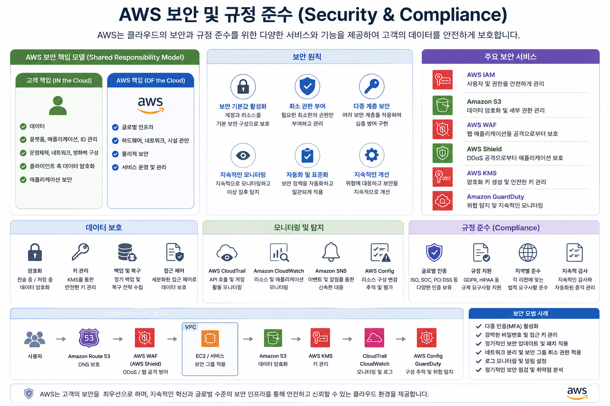

# AWS 보안 및 규정 준수(Security & Compliance)

---

# 학습 목표

이번 장에서는 다음 내용을 이해하는 것이 목표입니다.

* AWS IAM의 기본 개념
* 인증(Authentication)과 권한(Authorization)
* AWS의 보안 서비스
* 암호화 서비스
* AWS의 규정 준수(Compliance)
* 시험에서 자주 출제되는 보안 관련 내용

---

# 1. AWS 보안(Security)이 중요한 이유

클라우드에서는 서버가 인터넷에 연결되어 있기 때문에 보안이 매우 중요합니다.

```
보안(Security)

├── 누가 접근할 수 있는가?
│      └── IAM
│
├── 데이터는 안전한가?
│      └── KMS
│
├── 비밀번호는 안전하게 저장되는가?
│      └── Secrets Manager
│
├── 공격을 막을 수 있는가?
│      ├── WAF
│      └── Shield
│
├── 해킹을 탐지하는가?
│      ├── GuardDuty
│      ├── Inspector
│      └── Security Hub
│
└── 개인정보를 보호하는가?
       └── Macie
```



---

# 2. IAM (Identity and Access Management)

IAM은

> **"누가 어떤 AWS 서비스를 사용할 수 있는지 관리하는 서비스"**

입니다.

쉽게 말하면

> **AWS의 출입문 관리 시스템**

이라고 생각하면 됩니다.

예를 들어

```
학생
 ↓
EC2 사용 가능

교수
 ↓
EC2 + S3 + RDS 사용 가능

관리자
 ↓
모든 서비스 사용 가능
```

이 모든 권한을 IAM이 관리합니다.

---

## IAM의 특징

* 무료 서비스
* 계정 단위로 동작
* 사용자 생성 가능
* 권한 관리
* MFA 지원
* Role 지원

---

# 3. User

User는

> **실제 사람 또는 프로그램을 의미**

합니다.

예)

```
홍길동

AWS 로그인 가능

↓

IAM User
```

또는

```
Application

↓

IAM User
```

---

### User가 가지는 정보

* Username
* Password
* Access Key
* Secret Access Key

예)

```
student01

Password

Access Key
AKIA....

Secret Key
xxxxxxxx
```

---

# 4. Group

Group은

> **여러 명의 User를 묶는 집합**

입니다.

예)

```
학생 그룹

├── 학생1
├── 학생2
├── 학생3
```

권한은

```
Group

↓

Policy

↓

모든 User 적용
```

---

장점

새 학생이 들어오면

```
User 생성

↓

Student Group 추가

↓

권한 자동 적용
```

---

# 5. Role

Role은

> **AWS 서비스나 다른 계정이 임시로 사용하는 권한**

입니다.

User와 가장 큰 차이점은

User는

```
고정 사용자
```

Role은

```
임시 권한
```

입니다.

예)

EC2가

S3에 접근하려고 합니다.

```
EC2

↓

Role 획득

↓

S3 접근
```

Access Key를 저장하지 않아도 됩니다.

---

## Role 사용 사례

* EC2 → S3 접근
* Lambda → DynamoDB 접근
* ECS → S3 접근
* Cross Account Access
* Federation

---

# 6. Policy

Policy는

> **권한을 정의한 JSON 문서**

입니다.

예)

```
Allow

S3:GetObject
```

또는

```
Allow

EC2:StartInstances
```

Policy가 있어야 권한이 생깁니다.

---

### Policy 구조

```
Effect

Allow / Deny

↓

Action

↓

Resource
```

예)

```json
{
 "Effect":"Allow",
 "Action":"s3:GetObject",
 "Resource":"arn:aws:s3:::mybucket/*"
}
```

---

# 7. STS (Security Token Service)

STS는

> **임시 보안 자격 증명(Temporary Credentials)을 발급하는 서비스**

입니다.

예)

```
사용자

↓

STS

↓

1시간 사용 가능한 Access Key
```

장점

* 자동 만료
* 안전
* Role과 함께 사용

---

사용 사례

* Cross Account
* SSO
* Federation
* Mobile App

---

# 8. MFA (Multi-Factor Authentication)

MFA는

> **비밀번호 외에 추가 인증을 요구하는 보안 기능**

입니다.

예)

```
Password

+

OTP

=

로그인
```

MFA를 사용하면

비밀번호가 유출되어도 쉽게 로그인할 수 없습니다.

---

지원 방식

* Google Authenticator
* Authy
* Hardware MFA

---

# 9. Shared Responsibility Model

AWS 시험에서 가장 많이 출제되는 내용입니다.

> **AWS와 고객이 보안을 함께 책임진다.**

---

AWS가 책임지는 것

```
Cloud OF Security
```

예)

* 데이터센터
* 서버
* 네트워크
* 하드웨어
* 전원
* 냉각

---

고객이 책임지는 것

```
Security IN the Cloud
```

예)

* IAM
* 비밀번호
* 데이터 암호화
* 운영체제 패치(EC2)
* 애플리케이션
* 방화벽 설정

---

쉽게 이해하기

아파트 비유

AWS

```
건물 관리
```

고객

```
우리 집 문 잠그기
```

---

# 10. AWS Security Services

AWS에는 수십 개의 보안 서비스가 있지만 CCP에서는 아래 서비스를 중심으로 학습하면 됩니다.

| 분류          | 서비스          |
| ------------- | --------------- |
| 접근제어      | IAM             |
| 암호화        | KMS             |
| 비밀관리      | Secrets Manager |
| 웹 방어       | WAF             |
| DDoS 방어     | Shield          |
| 위협 탐지     | GuardDuty       |
| 취약점 점검   | Inspector       |
| 보안 통합     | Security Hub    |
| 개인정보 보호 | Macie           |

---

# 11. KMS (Key Management Service)

KMS는

> **암호화 키를 생성하고 관리하는 서비스**

입니다.

예)

```
데이터

↓

AES 암호화

↓

KMS Key 사용
```

---

사용 사례

* S3 암호화
* EBS 암호화
* RDS 암호화
* EFS 암호화

---

장점

* 키 관리 자동화
* 접근 권한 관리
* CloudTrail 기록

---

# 12. Secrets Manager

Secrets Manager는

> **비밀번호와 API Key를 안전하게 저장하는 서비스**

입니다.

예)

```
Database Password

↓

Secrets Manager
```

애플리케이션은

```
Secrets Manager

↓

비밀번호 가져오기
```

---

장점

* 자동 암호화
* 자동 Rotation
* API 제공

---

# 13. WAF

WAF는

> **웹 애플리케이션 공격을 차단하는 방화벽**

입니다.

막아주는 공격

* SQL Injection
* XSS
* Bot

적용 대상

* CloudFront
* ALB
* API Gateway

---

# 14. Shield

Shield는

> **DDoS 공격 방어 서비스**

입니다.

Shield Standard

* 무료
* 자동 제공

Shield Advanced

* 유료
* 고급 보호

---

# 15. GuardDuty

GuardDuty는

> **AI와 머신러닝 기반의 위협 탐지 서비스**

입니다.

탐지 대상

* 계정 탈취
* 악성 IP
* 이상 로그인
* 비정상 API 호출

---

# 16. Inspector

Inspector는

> **EC2, 컨테이너, Lambda의 취약점을 자동 검사하는 서비스**

입니다.

검사 내용

* CVE
* OS 취약점
* 패키지 취약점

CVE(Common Vulnerabilities and Expositions)는 공개적으로 알려진 컴퓨터 보안 취약점의 표준화된 목록입니다.전 세계 보안 전문가들이 서로 다른 이름으로 취약점을 부르는 혼란을 막기 위해 고유한 식별 번호를 부여하여 관리하는 것입니다.

---

# 17. Security Hub

Security Hub는

> **여러 보안 서비스의 결과를 한 곳에서 관리하는 통합 보안 대시보드**

입니다.

예)

```
GuardDuty

↓

Inspector

↓

Macie

↓

Security Hub
```

---

# 18. Macie

Macie는

> **S3에 저장된 민감한 개인정보를 자동으로 탐지하는 서비스**

입니다.

탐지 예

* 주민등록번호
* 신용카드 번호
* 이메일
* 개인정보

---

# 19. Compliance(규정 준수)

Compliance는

> **법률, 산업 표준, 기업 정책을 준수하는 것**

입니다.

AWS는 다양한 국제 인증을 획득하여 고객이 규정을 준수할 수 있도록 지원합니다.

---

## SOC

SOC(Service Organization Control)는

감사 보고서입니다.

종류

* SOC 1
* SOC 2
* SOC 3

기업 고객이

AWS의 운영이 안전한지 확인할 수 있습니다.

---

## ISO 27001

가장 유명한

> **국제 정보보호 관리체계(ISMS) 표준**

입니다.

의미

```
정보보호 관리체계가 국제 기준에 맞게 운영됨
```

---

## PCI-DSS

신용카드 산업 보안 표준입니다.

사용 분야

* 카드 결제
* 온라인 쇼핑몰
* 금융 서비스

예)

```
쇼핑몰

↓

Visa

↓

Master

↓

PCI-DSS 준수
```

---

## HIPAA

미국 의료정보 보호법입니다.

사용 분야

* 병원
* 의료 데이터
* 건강보험

AWS는 HIPAA를 지원하는 서비스를 제공하여 의료 정보를 안전하게 처리할 수 있도록 지원합니다.

---

# 시험에서 자주 출제되는 비교

## ① User vs Group vs Role

| 항목     | User                      | Group                       | Role                                  |
| -------- | ------------------------- | --------------------------- | ------------------------------------- |
| 의미     | 사람 또는 애플리케이션 계정           | 사용자들의 집합                    | 임시 권한                                 |
| 로그인 가능 | O                         | X                           | 직접 로그인하지 않음(위임받아 사용)                  |
| 자격증명   | 장기 자격증명(비밀번호, Access Key) | 없음                          | 주로 STS를 통한 임시 자격증명                    |
| 권한 부여  | 직접 Policy 연결 가능           | Group에 연결된 Policy를 구성원에게 상속 | Policy를 연결하여 서비스나 사용자에게 위임            |
| 대표 사용  | 개발자 계정                    | 개발팀, 학생 그룹                  | EC2→S3, Lambda→DynamoDB, 다른 AWS 계정 접근 |

---

## ② User vs Role

| User                 | Role                               |
| -------------------- | ---------------------------------- |
| 장기 사용            | 임시 사용                          |
| 사람 중심            | 서비스·애플리케이션·다른 계정 중심 |
| Access Key 저장 가능 | STS 기반 임시 자격증명 사용        |
| 로그인 가능          | 역할을 위임받아 사용               |

> **시험 포인트:** EC2가 S3에 접근해야 한다면 Access Key를 코드에 저장하지 말고 **IAM Role**을 사용하는 것이 권장됩니다.

---

## ③ Role vs STS

| Role                   | STS                                               |
| ---------------------- | ------------------------------------------------- |
| 권한의 집합            | 임시 자격증명을 발급하는 서비스                   |
| Policy를 포함          | Role을 가정(Assume)한 결과로 임시 Access Key 제공 |
| "무엇을 할 수 있는가?" | "얼마 동안 사용할 자격증명을 발급할 것인가?"      |

---

## ④ Policy vs Role

| Policy                               | Role                                     |
| ------------------------------------ | ---------------------------------------- |
| 권한을 정의하는 JSON 문서            | Policy를 담고 있는 권한 컨테이너         |
| 단독으로는 권한을 사용할 주체가 아님 | 사용자나 서비스가 위임받아 사용하는 대상 |
| User, Group, Role에 연결 가능        | 하나 이상의 Policy를 연결하여 권한 제공  |

---

## ⑤ KMS vs Secrets Manager

| 항목                | KMS                       | Secrets Manager            |
| ------------------- | ------------------------- | -------------------------- |
| 목적                | 암호화 키 관리            | 비밀번호·API Key·토큰 관리 |
| 저장 대상           | 암호화 키(CMK/KMS Key)    | Secret 값                  |
| 자동 교체(Rotation) | 키 교체 지원(설정에 따라) | Secret 자동 Rotation 지원  |
| 주요 사용           | S3, EBS, RDS 암호화       | DB 비밀번호, API Key       |

> **시험 포인트:** "비밀번호를 저장"이면 **Secrets Manager**, "암호화 키를 관리"이면 **KMS**를 떠올리면 됩니다.

---

## ⑥ WAF vs Shield

| 항목      | WAF                           | Shield                                        |
| --------- | ----------------------------- | --------------------------------------------- |
| 보호 대상 | 웹 애플리케이션               | 네트워크 및 DDoS 공격                         |
| 방어 공격 | SQL Injection, XSS, Bot       | DDoS                                          |
| 동작 계층 | 애플리케이션 계층(HTTP/HTTPS) | 네트워크/전송 계층 중심                       |
| 대표 적용 | ALB, CloudFront, API Gateway  | AWS 서비스 전반(CloudFront, Route 53, ELB 등) |

---

## ⑦ GuardDuty vs Inspector vs Security Hub vs Macie

| 서비스       | 역할          | 대표 기능                                  |
| ------------ | ------------- | ------------------------------------------ |
| GuardDuty    | 위협 탐지     | 이상 로그인, 악성 IP, 비정상 API 호출 탐지 |
| Inspector    | 취약점 평가   | EC2, 컨테이너, Lambda의 보안 취약점 검사   |
| Security Hub | 보안 통합     | 여러 보안 서비스 결과를 한 화면에서 관리   |
| Macie        | 개인정보 보호 | S3의 민감 정보 및 개인정보 자동 탐지       |

> **쉽게 기억하기**
>
> * **GuardDuty** → "공격을 찾아낸다."
> * **Inspector** → "취약점을 검사한다."
> * **Security Hub** → "결과를 모아서 보여준다."
> * **Macie** → "개인정보를 찾아낸다."

---

## ⑧ Shared Responsibility Model

| AWS 책임 (Security **of** the Cloud) | 고객 책임 (Security **in** the Cloud) |
| ------------------------------------ | ------------------------------------- |
| 데이터센터                           | IAM 설정                              |
| 물리 서버                            | 운영체제 패치(EC2)                    |
| 네트워크 인프라                      | 애플리케이션 보안                     |
| 하드웨어                             | 데이터 암호화                         |
| 전원·냉각                            | 보안 그룹, 네트워크 설정              |
| 하이퍼바이저                         | 사용자 및 권한 관리                   |

---

## ⑨ 주요 Compliance 비교

| 규정      | 목적                                | 적용 분야                   |
| --------- | ----------------------------------- | --------------------------- |
| SOC       | 서비스 운영 통제에 대한 감사 보고서 | 클라우드 서비스 신뢰성 평가 |
| ISO 27001 | 정보보호 관리체계 국제 표준         | 전 산업                     |
| PCI-DSS   | 카드 결제 정보 보호                 | 금융, 전자상거래            |
| HIPAA     | 의료정보 보호                       | 의료·헬스케어               |

---

# CCP 시험 핵심 암기 포인트

| 키워드                | 핵심 한 줄 요약                                  |
| --------------------- | ------------------------------------------------ |
| IAM                   | 사용자와 권한을 관리하는 서비스                  |
| User                  | 실제 사용자 또는 애플리케이션 계정               |
| Group                 | 여러 User를 묶어 동일한 권한을 부여              |
| Role                  | 서비스나 다른 계정에 위임하는 임시 권한          |
| Policy                | 권한을 정의한 JSON 문서                          |
| STS                   | 임시 보안 자격증명을 발급하는 서비스             |
| MFA                   | 비밀번호 외 추가 인증으로 계정 보호              |
| Shared Responsibility | AWS와 고객이 보안을 분담                         |
| KMS                   | 암호화 키 관리 서비스                            |
| Secrets Manager       | 비밀번호와 API Key를 안전하게 저장 및 관리       |
| WAF                   | 웹 애플리케이션 공격(SQL Injection, XSS 등) 차단 |
| Shield                | DDoS 공격 방어 서비스                            |
| GuardDuty             | 위협을 탐지하는 서비스                           |
| Inspector             | 보안 취약점을 검사하는 서비스                    |
| Security Hub          | 보안 결과를 통합 관리하는 서비스                 |
| Macie                 | S3의 민감 정보 및 개인정보 탐지                  |
| SOC                   | 서비스 운영 통제에 대한 감사 보고서              |
| ISO 27001             | 국제 정보보호 관리체계 표준                      |
| PCI-DSS               | 신용카드 정보 보호 표준                          |
| HIPAA                 | 미국 의료정보 보호 규정                          |

이 정도 수준으로 각 서비스의 역할과 차이점을 이해하면 AWS CCP 시험의 **보안 및 규정 준수(Security & Compliance)** 영역에서 출제되는 핵심 개념을 대부분 대비할 수 있습니다. 특히 **IAM(User, Group, Role, Policy)**, **Shared Responsibility Model**, **KMS vs Secrets Manager**, **WAF vs Shield**, **GuardDuty vs Inspector vs Security Hub vs Macie**는 비교 문제로 자주 출제되므로 반드시 구분해서 학습하는 것을 권장합니다.
