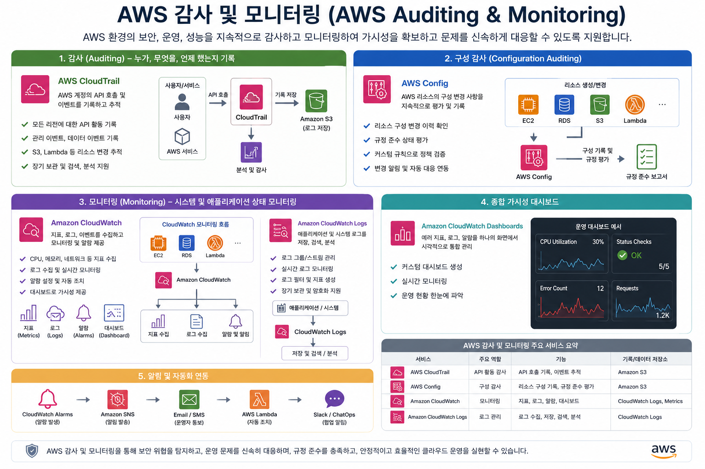

# AWS 감사 및 모니터링(AWS Auditing & Monitoring)

AWS를 운영하다 보면 가장 많이 받는 질문이 있습니다.

> **"서버가 왜 멈췄나요?"**
>
> **"누가 EC2를 삭제했나요?"**
>
> **"CPU가 왜 갑자기 100%가 되었나요?"**
>
> **"보안 그룹이 언제 변경되었나요?"**

AWS에서는 이러한 문제를 해결하기 위해 크게 **3개의 핵심 서비스**를 제공합니다.

| 서비스         | 역할                                          |
| -------------- | --------------------------------------------- |
| **CloudTrail** | 누가 무엇을 했는가? (사용자 활동 기록)        |
| **AWS Config** | 현재 설정이 올바른가? 설정 변경 이력 관리     |
| **CloudWatch** | 시스템이 현재 정상인가? 성능 및 상태 모니터링 |

쉽게 말하면

> **CloudTrail = 행동 기록(CCTV)**

> **AWS Config = 환경설정 관리**

> **CloudWatch = 건강 상태 모니터**

AWS CCP 시험에서도 이 세 서비스의 차이를 매우 자주 묻습니다.

---

## 전체 개요도



---

# 1. CloudTrail

## CloudTrail이란?

CloudTrail은

> **AWS 계정에서 발생하는 모든 API 호출을 기록하는 서비스**입니다.

즉,

**누가**
→ **언제**
→ **무엇을**
→ **어디에서**
→ **성공했는지 실패했는지**

를 모두 기록합니다.

---

## 쉽게 비유하면

회사 출입문에 CCTV가 있다고 생각해 봅시다.

CCTV는

* 누가 들어왔는지
* 몇 시에 들어왔는지
* 어디로 갔는지

모두 기록합니다.

CloudTrail도 동일합니다.

AWS 안에서 발생하는 모든 행동을 기록합니다.

---

## 기록하는 예

예를 들어

관리자가 EC2를 삭제했습니다.

CloudTrail에는 다음과 같이 저장됩니다.

```
User : admin

Action : TerminateInstances

Resource : EC2

Time : 2026-07-01 14:22

Source IP : 210.xxx.xxx.xxx

Result : Success
```

---

## 기록하는 내용

CloudTrail은 다음을 기록합니다.

* EC2 생성
* EC2 삭제
* S3 생성
* IAM 사용자 생성
* VPC 생성
* Security Group 변경
* Lambda 실행
* RDS 삭제

즉,

거의 모든 AWS API 호출을 기록합니다.

---

## 활용 예

### 예제 1

EC2가 갑자기 삭제되었습니다.

질문

> 누가 삭제했는가?

CloudTrail 확인

```
DeleteInstances

User : student01

Time : 09:10
```

원인을 바로 알 수 있습니다.

---

### 예제 2

보안 그룹이 변경되었습니다.

CloudTrail

```
AuthorizeSecurityGroupIngress
```

누가 포트를 열었는지 확인 가능합니다.

---

## CloudTrail 특징

* API 호출 기록
* 사용자 활동 기록
* 감사(Audit)
* 보안 조사
* 규정 준수

---

# 2. AWS Config

CloudTrail이

> "누가 변경했는가"

를 기록한다면

AWS Config는

> **현재 AWS 리소스의 설정(Configuration)가 어떻게 되어 있는지 관리하는 서비스**입니다.

---

## 쉽게 비유하면

컴퓨터 설정을 생각해봅시다.

```
IP 주소

DNS

Firewall

사용자 계정
```

이런 설정을 관리합니다.

AWS Config도

AWS 리소스들의 설정을 계속 저장합니다.

---

## 예시

EC2

```
Instance Type

t3.micro
```

관리자가

```
t3.large
```

로 변경했습니다.

AWS Config는

변경 전

```
t3.micro
```

변경 후

```
t3.large
```

모두 저장합니다.

---

## 변경 이력 관리

AWS Config는

시간별로

```
09:00

t3.micro

↓

14:00

t3.small

↓

18:00

t3.large
```

이력을 저장합니다.

---

## Config Rule

AWS Config에는 매우 중요한 기능이 있습니다.

바로

**Config Rules**

입니다.

예를 들어

회사 정책이

```
S3는 반드시 암호화되어야 한다.
```

라고 가정합니다.

Config Rule

```
S3 Encryption = Enabled
```

만약 누군가 암호화를 끄면

```
NON-COMPLIANT
```

라고 알려줍니다.

---

## 또 다른 예

회사 정책

```
Security Group

22번 포트

0.0.0.0/0 금지
```

Config가 검사합니다.

위반하면

```
Non-compliant
```

가 됩니다.

---

## AWS Config 특징

* 리소스 설정 관리
* 변경 이력 저장
* 규정 준수 검사
* Compliance 확인
* 자동 정책 검사

---

# 3. CloudWatch

CloudWatch는

AWS 리소스의 상태를 실시간으로 모니터링하는 서비스입니다.

---

## 쉽게 비유하면

병원에서 환자를 모니터링하는 기계를 생각해 보세요.

보는 항목은

* 심박수
* 혈압
* 체온

입니다.

CloudWatch는

AWS 리소스의 건강 상태를 계속 확인합니다.

---

## 모니터링 항목

예를 들어 EC2

* CPU
* Memory(에이전트 설치 시)
* Disk(에이전트 설치 시)
* Network
* Status Check

등을 확인합니다.

---

## CPU 예시

```
CPU

20%

↓

35%

↓

40%

↓

95%

```

CloudWatch는

실시간으로 그래프를 보여줍니다.

---

## CloudWatch Alarm

CPU가

80%

이상이 되면

```
Alarm 발생
```

SNS로 메일 전송

또는

Lambda 실행

또는

Auto Scaling 실행

등이 가능합니다.

---

## Logs

CloudWatch는 로그도 저장합니다.

예

```
Application Log

Apache Log

System Log

Lambda Log
```

---

## Dashboard

CloudWatch Dashboard에서는

여러 서버를 동시에 볼 수 있습니다.

```
EC2-1

CPU 30%

----------------

EC2-2

CPU 75%

----------------

RDS

Storage 60%
```

한 화면에서 확인 가능합니다.

---

## CloudWatch 특징

* 성능 모니터링
* 메트릭 수집
* 로그 저장
* 알람
* 대시보드
* 자동화 연계

---

# 서비스별 대표 사용 사례

| 상황                     | 사용하는 서비스                | 이유                                               |
| ---------------------- | ----------------------- | ------------------------------------------------ |
| 누가 EC2를 삭제했는지 확인       | CloudTrail              | API 호출과 사용자 활동을 기록                               |
| 보안 그룹이 언제 변경되었는지 확인    | AWS Config + CloudTrail | Config는 변경된 설정과 이력, CloudTrail은 변경한 사용자와 API를 기록 |
| CPU 사용률이 높은 원인 분석      | CloudWatch              | 성능 메트릭을 실시간으로 수집                                 |
| 디스크 공간 부족 감지           | CloudWatch              | 디스크 사용량 모니터링 및 알람                                |
| 회사 보안 정책 준수 여부 확인      | AWS Config              | Config Rules를 통한 규정 준수 검사                        |
| 누가 IAM 사용자를 생성했는지 확인   | CloudTrail              | IAM API 호출 기록                                    |
| S3 버킷 암호화가 해제되었는지 확인   | AWS Config              | 리소스 설정 변경 감지 및 규정 준수 확인                          |
| CPU가 80%를 넘으면 관리자에게 알림 | CloudWatch              | Alarm과 알림 기능 제공                                  |

---

# CloudTrail · AWS Config · CloudWatch 비교

| 비교 항목    | CloudTrail             | AWS Config                   | CloudWatch               |
| ------------ | ---------------------- | ---------------------------- | ------------------------ |
| 목적         | 사용자 활동 감사              | 리소스 구성 관리 및 규정 준수            | 리소스 성능 및 상태 모니터링         |
| 핵심 질문    | 누가 무엇을 했는가?            | 현재 설정이 올바른가?                 | 지금 시스템은 정상인가?            |
| 기록 대상    | API 호출, 콘솔 로그인, 사용자 활동 | 리소스 구성(Configuration)과 변경 이력 | 메트릭, 로그, 이벤트             |
| 저장 정보    | API 이벤트                | 리소스 설정 스냅샷 및 변경 기록           | CPU, 메모리, 네트워크, 로그 등     |
| 변경 이력    | 사용자의 작업 이력             | 리소스 설정 변경 이력                 | 메트릭 추이 및 로그              |
| 실시간 모니터링 | 아니오                    | 아니오(구성 변경 감지)                | 예                        |
| 알람 기능    | 없음                     | 제한적                          | CloudWatch Alarm 제공      |
| 규정 준수 검사 | 감사 자료 제공               | Config Rules를 통한 자동 검사       | 직접 제공하지 않음               |
| 대표 활용    | 보안 감사, 사고 조사           | 규정 준수, 구성 변경 추적              | 운영 모니터링, 장애 감지           |
| 주요 저장 위치 | Amazon S3(로그 저장)       | 구성 기록 저장소 및 규정 준수 결과         | CloudWatch Metrics, Logs |

---

# 시험에서 자주 출제되는 문제

### 문제 1

**EC2 인스턴스를 누가 삭제했는지 확인하려고 한다. 어떤 서비스를 사용해야 하는가?**

**정답:** CloudTrail

---

### 문제 2

**회사 정책상 모든 S3 버킷은 암호화되어 있어야 한다. 정책 위반 여부를 자동으로 확인하려면 어떤 서비스를 사용해야 하는가?**

**정답:** AWS Config

---

### 문제 3

**EC2 CPU 사용률이 80%를 초과하면 관리자에게 이메일을 보내려면 어떤 서비스를 사용해야 하는가?**

**정답:** CloudWatch Alarm

---

### 문제 4

**보안 그룹의 설정이 언제 어떻게 변경되었는지와 변경한 사용자를 모두 확인하려면 어떤 서비스를 함께 사용하는 것이 가장 적절한가?**

**정답:** AWS Config + CloudTrail

* **AWS Config**: 무엇이 어떻게 변경되었는지(구성 변경 이력)
* **CloudTrail**: 누가 언제 변경했는지(API 호출 및 사용자 활동)

---

# AWS CCP 핵심 암기 포인트

| 서비스         | 한 줄 암기                                                              |
| -------------- | ----------------------------------------------------------------------- |
| **CloudTrail** | **누가(Who) 무엇을 했는지 기록하는 감사 서비스**                        |
| **AWS Config** | **리소스 설정과 변경 이력을 관리하고 규정 준수 여부를 확인하는 서비스** |
| **CloudWatch** | **AWS 리소스의 성능, 상태, 로그를 모니터링하고 알람을 제공하는 서비스** |

### 시험 대비 암기 공식

* **CloudTrail = 감사(Audit) = API 기록 = Who did it?**
* **AWS Config = 구성(Configuration) = 설정 관리 = Is it compliant?**
* **CloudWatch = 모니터링(Monitoring) = 성능·로그·알람 = Is it healthy?**

이 세 서비스를 함께 사용하면 **CloudTrail**은 "누가 변경했는지", **AWS Config**는 "무엇이 어떻게 변경되었는지", **CloudWatch**는 "현재 시스템 상태가 정상인지"를 각각 담당하여 AWS 환경의 감사, 보안, 운영을 종합적으로 관리할 수 있습니다. 이는 AWS CCP 시험에서 가장 자주 비교되는 핵심 개념 중 하나입니다.
