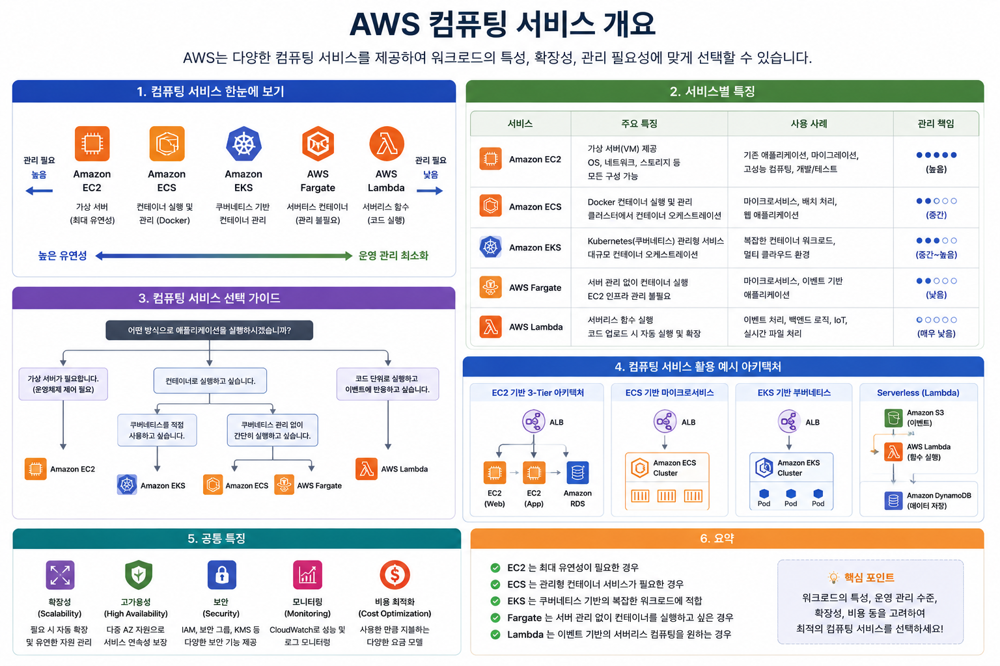
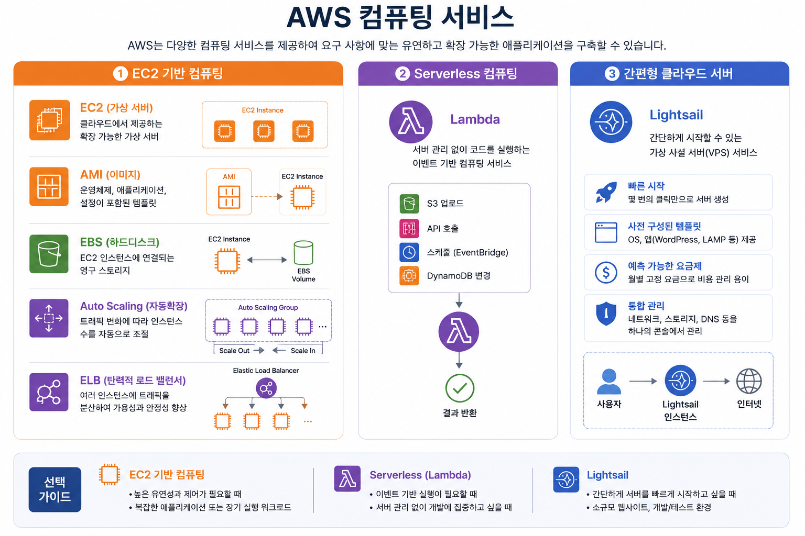
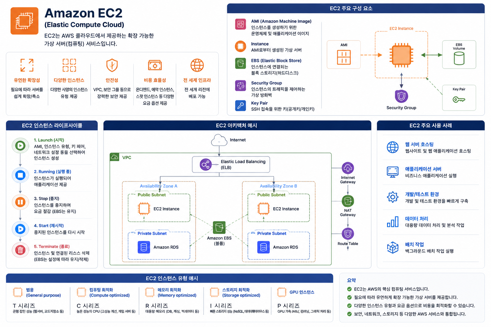
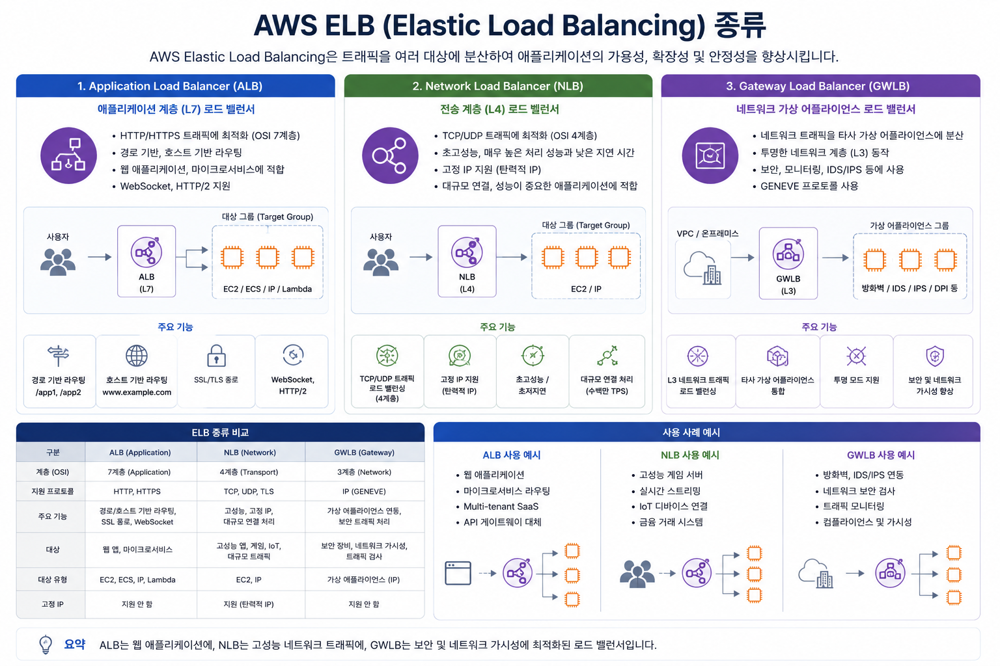
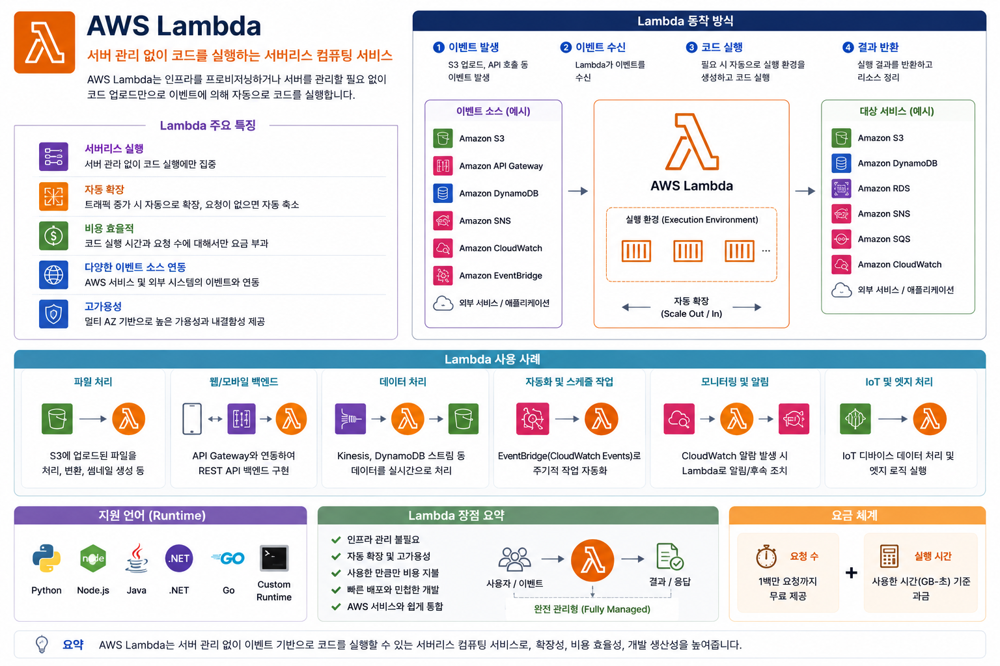
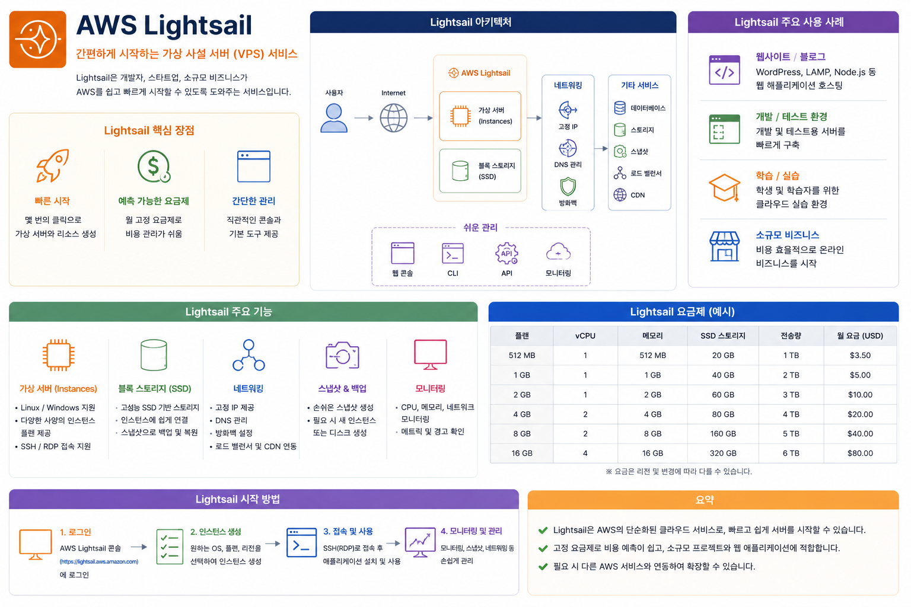

# AWS 클라우드 기술 및 서비스

## 1 AWS 컴퓨팅 서비스 개요



### 학습목표

* AWS의 대표적인 컴퓨팅 서비스를 이해한다.
* 서버 기반 컴퓨팅과 서버리스 컴퓨팅의 차이를 이해한다.
* AWS CCP에서 자주 출제되는 컴퓨팅 서비스의 관계를 이해한다.

### AWS 컴퓨팅 서비스 분류



```text
AWS 컴퓨팅 서비스

├── ① EC2 기반 컴퓨팅
│      ├── EC2 (가상 서버)
│      ├── AMI (이미지)
│      ├── EBS (하드디스크)
│      ├── Auto Scaling (자동확장)
│      └── ELB (탄력적로드밸런서)
│
├── ② Serverless 컴퓨팅
│      └── Lambda
│
└── ③ 간편형 클라우드 서버
       └── Lightsail
```

---

# 1. EC2 (Elastic Compute Cloud)

## EC2란?



EC2는 AWS에서 제공하는 **가상 서버(Virtual Machine)** 입니다.

쉽게 말하면

> "AWS 데이터센터 안에 내 컴퓨터를 하나 빌리는 것"

이라고 생각하면 됩니다.

예를 들어

* Windows PC
* Ubuntu Linux
* Amazon Linux

등을 원하는 사양으로 생성할 수 있습니다.

---

## EC2 특징

* 원하는 CPU 선택
* 원하는 Memory 선택
* 원하는 OS 선택
* 원하는 Region 선택
* 원하는 Storage(EBS) 연결

필요하면

* 하루만 사용
* 1시간만 사용
* 몇 년간 사용

모두 가능합니다.

---

## 사용 사례

* 웹 서버
* DB 서버
* 게임 서버
* AI 서버
* Docker 서버
* Kubernetes 노드

---

## 예시

학생이 쇼핑몰을 만든다면

```
EC2

↓

Ubuntu 설치

↓

Apache 설치

↓

쇼핑몰 실행
```

---

# 2. AMI (Amazon Machine Image)

## AMI란?

AMI는

> **EC2를 만들기 위한 설치 이미지(Image)** 입니다.

컴퓨터에서

* Windows ISO
* Ubuntu ISO

와 비슷한 개념입니다.

---

## AMI 안에는

* 운영체제(OS)
* Application
* 설정
* 라이브러리
* 패키지

모두 포함될 수 있습니다.

---

## 예시

이미 만들어 놓은 EC2

```
Ubuntu

+

Python

+

Java

+

MySQL

+

Nginx
```

↓

AMI 생성

↓

같은 서버를 100대 생성 가능

---

## 장점

* 빠른 서버 생성
* 동일한 환경 유지
* 백업 가능

---

# 3. EBS (Elastic Block Store)

## EBS란?

EBS는

> **EC2에 연결하는 하드디스크(SSD/HDD)** 입니다.

EC2는 컴퓨터이고,

EBS는 저장장치입니다.

---

## 특징

* 데이터 영구 저장
* EC2 종료 후에도 유지 가능
* Snapshot 백업 지원
* 용량 변경 가능

---

## 비유

```
노트북

↓

SSD 장착

↓

데이터 저장
```

AWS에서는

```
EC2

↓

EBS 연결

↓

데이터 저장
```

---

## 사용 사례

* 웹 서버 데이터
* Database
* 로그 저장
* 프로그램 저장

---

# 4. Auto Scaling

## Auto Scaling이란?

Auto Scaling은

> **EC2 개수를 자동으로 늘리고 줄이는 서비스**

입니다.

---

## 예시

평소

```
EC2 2대
```

사용

↓

블랙프라이데이

↓

접속 폭주

↓

자동

```
EC2

2대

↓

10대
```

↓

행사 종료

↓

```
10대

↓

2대
```

자동 축소

---

## 장점

* 자동 확장
* 자동 축소
* 비용 절감
* 장애 대응

---

## 확장 기준

예를 들어

CPU

```
70%

이상

↓

EC2 추가
```

CPU

```
20%

이하

↓

EC2 제거
```

---

# 5. ELB (Elastic Load Balancing)

## ELB란?

ELB는

> **여러 EC2에 요청을 나누어 주는 서비스**

입니다.

---

## 왜 필요한가?

사용자가 10,000명 접속하면

EC2 한 대는 처리하기 어렵습니다.

그래서

```
사용자

↓

ELB

↓

EC2 1

EC2 2

EC2 3
```

처럼 요청을 분산합니다.

---

## 장점

* 부하 분산
* 장애 서버 제외
* 고가용성
* 자동 확장과 연동

---

## ELB 종류



### ALB (Application Load Balancer)

HTTP/HTTPS

웹 서비스

---

### NLB (Network Load Balancer)

TCP/UDP

고성능

---

### GWLB (Gateway Load Balancer)

방화벽

보안 장비

---

# 6. Lambda



## Lambda란?

Lambda는

> **서버를 만들지 않고 프로그램만 실행하는 서비스**

입니다.

이를 **서버리스(Serverless)** 컴퓨팅이라고 합니다.

---

## 동작 방식

```
파일 업로드

↓

Lambda 실행

↓

이미지 변환

↓

종료
```

서버를 계속 켜둘 필요가 없습니다.

---

## 장점

* 서버 관리 불필요
* 자동 확장
* 사용한 만큼 과금
* 이벤트 기반 실행

---

## 사용 사례

* 이미지 리사이즈
* 알림 발송
* API 처리
* 데이터 변환
* 자동화 작업

---

# 7. Lightsail



## Lightsail이란?

Lightsail은

> **초보자를 위한 간편한 AWS 서버 서비스**

입니다.

EC2보다 설정이 훨씬 쉽습니다.

---

## 포함되는 것

Lightsail 하나 생성하면

* 서버
* SSD
* IP
* DNS
* 방화벽

모두 포함됩니다.

---

## 사용 사례

* 개인 홈페이지
* 블로그
* WordPress
* 개발 테스트

---

## 특징

월 요금이 고정입니다.

예)

```
월 10달러

↓

CPU

RAM

SSD

IP 포함
```

초보자가 사용하기 쉽습니다.

---

# 실무 예제

쇼핑몰 구축

```
                인터넷

                    │

                 ELB

          ┌──────────────┐

      EC2 #1         EC2 #2

          │              │

        EBS            EBS

          ▲

    Auto Scaling

          ▲

         AMI
```

평소

```
EC2 2대
```

↓

행사

```
EC2 20대
```

↓

행사 종료

```
EC2 2대
```

자동

---

이미지 업로드

```
사용자

↓

S3 업로드

↓

Lambda 실행

↓

썸네일 생성
```

---

WordPress 블로그

```
Lightsail

↓

5분 안에 구축
```

---

# AWS CCP 시험 핵심 포인트

| 서비스       | 핵심 개념            | 시험에서 기억할 내용                |
| ------------ | -------------------- | ----------------------------------- |
| EC2          | 가상 서버            | 원하는 OS와 사양으로 서버 생성      |
| AMI          | 서버 이미지          | 동일한 EC2를 빠르게 복제하는 템플릿 |
| EBS          | 블록 스토리지        | EC2에 연결하는 영구 저장소          |
| Auto Scaling | 자동 확장            | 트래픽에 따라 EC2 수를 자동 조절    |
| ELB          | 부하 분산            | 여러 EC2에 트래픽을 균등하게 분산   |
| Lambda       | 서버리스 컴퓨팅      | 서버 관리 없이 코드만 실행          |
| Lightsail    | 간편한 클라우드 서버 | 고정 요금으로 빠르게 서버 구축      |

---

# 서비스별 비교

| 비교 항목    | EC2                | AMI       | EBS           | Auto Scaling | ELB              | Lambda         | Lightsail    |
| -------- | ------------------ | --------- | ------------- | ------------ | ---------------- | -------------- | ------------ |
| 역할       | 가상 서버              | 서버 템플릿    | 저장소           | EC2 자동 증감    | 트래픽 분산           | 코드 실행          | 간편한 서버       |
| 서버 관리    | 필요                 | 해당 없음     | 해당 없음         | EC2 관리 지원    | 관리형              | 불필요            | 최소화          |
| 주요 목적    | 애플리케이션 실행          | 동일 환경 배포  | 데이터 저장        | 가용성 및 비용 최적화 | 고가용성             | 이벤트 기반 처리      | 빠른 서비스 구축    |
| 자동 확장    | 직접 구성              | 해당 없음     | 용량 확장 가능      | 자동           | Auto Scaling과 연동 | 자동             | 제한적          |
| 과금 기준    | 실행 시간 및 인스턴스 유형    | 저장 용량     | 용량·성능         | 관리 대상 리소스    | 사용량              | 실행 횟수·실행 시간    | 월 고정 요금      |
| 대표 사용 사례 | 웹 서버, DB 서버, AI 서버 | 표준 이미지 배포 | 데이터베이스, 로그 저장 | 트래픽 급증 대응    | 대규모 웹 서비스        | 파일 처리, 알림, API | 개인 홈페이지, 블로그 |

---

# AWS CCP 시험에서 자주 출제되는 비교 문제

| 질문                                                 | 정답             |
| ---------------------------------------------------- | ---------------- |
| 가상 서버는?                                         | **EC2**          |
| EC2를 생성하는 이미지 템플릿은?                      | **AMI**          |
| EC2에 연결하는 영구 저장소는?                        | **EBS**          |
| 트래픽 증가 시 EC2 수를 자동으로 늘리는 서비스는?    | **Auto Scaling** |
| 여러 EC2로 요청을 분산하는 서비스는?                 | **ELB**          |
| 서버를 프로비저닝하지 않고 코드를 실행하는 서비스는? | **Lambda**       |
| 초보자를 위한 고정 요금형 서버 서비스는?             | **Lightsail**    |

---

# 반드시 기억해야 하는 핵심 관계

```
AMI
 ↓
EC2 생성
 ↓
EBS 연결
 ↓
ELB가 트래픽 분산
 ↓
Auto Scaling이 EC2 자동 증감
```

그리고 별도로,

```
이벤트가 발생하면
      ↓
Lambda가 서버 없이 코드 실행
```

```
간단한 웹사이트나 개인 프로젝트
      ↓
Lightsail로 빠르게 구축
```

이 관계를 이해하면 AWS CCP 시험의 컴퓨팅 서비스 관련 문제 대부분을 해결할 수 있습니다. 특히 **EC2–AMI–EBS–ELB–Auto Scaling**의 연계 구조와 **Lambda(서버리스)**, **Lightsail(간편형 VPS)** 의 차이를 구분하는 것이 시험의 핵심입니다.
