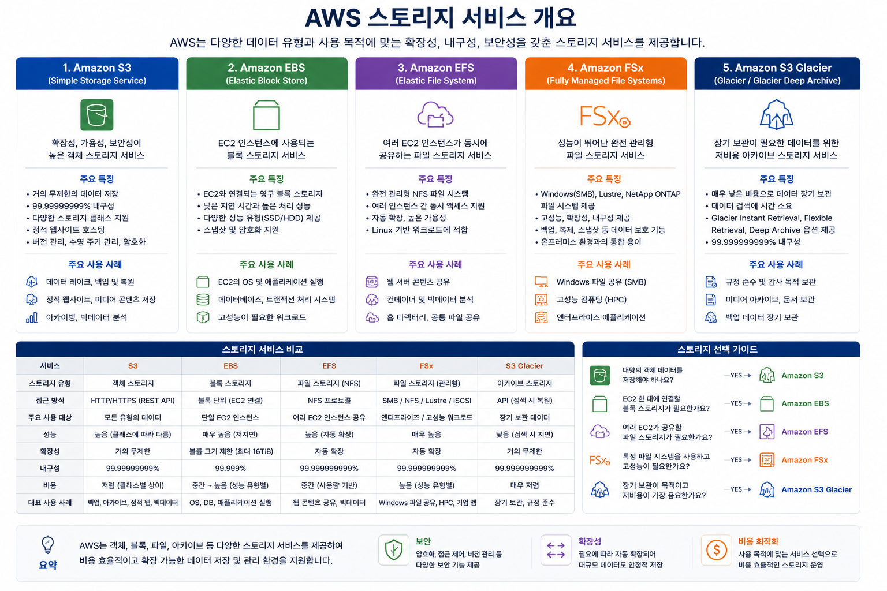

# AWS 클라우드 기술 및 서비스 - 스토리지(Storage) 서비스

AWS에서는 저장하려는 데이터의 특성에 따라 다양한 스토리지 서비스를 제공합니다.

이번 시간에는 다음 5가지 서비스를 학습하겠습니다.

* S3
* Storage Classes
* EFS
* FSx
* Glacier

---

# AWS 스토리지 서비스 개요



AWS의 스토리지는 크게 3가지 형태로 나눌 수 있습니다.

| 구분            | 서비스   | 저장 방식         |
| --------------- | -------- | ----------------- |
| Object Storage  | S3       | 파일(Object) 저장 |
| File Storage    | EFS, FSx | 파일 시스템 저장  |
| Archive Storage | Glacier  | 장기 보관         |

먼저 전체 관계를 보면 다음과 같습니다.

```
                AWS Storage

                     │
      ┌──────────────┼──────────────┐
      │              │              │
      │              │              │
   Object         File         Archive
   Storage       Storage       Storage
      │              │              │
     S3        EFS / FSx        Glacier
      │
      └── Storage Classes
```

---

# 1. Amazon S3 (Simple Storage Service)

## S3란?

Amazon S3는 AWS에서 가장 많이 사용하는 **객체(Object) 스토리지** 서비스입니다.

파일을 Object 형태로 저장하며 서버가 없어도 데이터를 저장할 수 있습니다.

S3는 사실상 무제한 용량을 제공합니다.

> "인터넷상의 거대한 하드디스크"라고 생각하면 됩니다.

---

## S3 저장 구조

```
Bucket
   │
   ├── photo.jpg
   ├── movie.mp4
   ├── report.pdf
   ├── backup.zip
   └── music.mp3
```

Bucket 안에 Object가 저장됩니다.

---

## S3 구성요소

### Bucket

폴더와 비슷하지만 실제로는 최상위 저장 공간입니다.

예)

```
student-photo
company-backup
aws-training
```

**Bucket 이름은 전 세계에서 유일**해야 합니다.

---

### Object

실제 저장되는 데이터입니다.

예)

```
photo.jpg

size : 3MB

metadata

permissions
```

---

### Key

Object의 이름입니다.

예)

```
images/cat.jpg

videos/aws.mp4

docs/report.pdf
```

---

## S3 특징

* 무제한 저장
* 99.999999999%(11 Nine) 내구성
* 높은 가용성
* 자동 확장
* HTTPS 지원
* 버전 관리 가능
* 암호화 가능
* Lifecycle 정책 지원

---

## 사용 사례

* 홈페이지 이미지
* 동영상 저장
* 모바일 앱 이미지
* 백업
* 로그 저장
* 데이터 레이크
* AI 학습 데이터

---

# 2. S3 Storage Classes

모든 데이터를 같은 가격으로 저장할 필요는 없습니다.

자주 사용하는 데이터도 있고,

1년에 한 번만 사용하는 데이터도 있습니다.

그래서 AWS는 여러 Storage Class를 제공합니다.

---

## Storage Classes 종류

```
S3

├── Standard
├── Intelligent-Tiering
├── Standard-IA
├── One Zone-IA
├── Glacier Instant Retrieval
├── Glacier Flexible Retrieval
├── Glacier Deep Archive
└── Express One Zone
```

---

## (1) S3 Standard

가장 기본적인 클래스입니다.

특징

* 자주 접근
* 높은 성능
* 여러 AZ 저장
* 가장 많이 사용

예)

```
웹사이트 이미지

앱 데이터

동영상
```

---

## (2) Intelligent-Tiering

AWS가 자동으로 데이터를 이동합니다.

```
자주 사용

↓

가끔 사용

↓

거의 사용 안함
```

사용자가 직접 관리하지 않아도 됩니다.

---

## (3) Standard-IA

IA = Infrequent Access

가끔 사용하는 데이터

예)

```
백업

재해복구 데이터
```

---

## (4) One Zone-IA

한 개 AZ에만 저장합니다.

따라서 더 저렴합니다.

단점

AZ 장애 시 데이터 손실 가능성이 있습니다.

---

## (5) Glacier Instant Retrieval

아카이브 데이터이지만 거의 즉시 접근 가능합니다.

---

## (6) Glacier Flexible Retrieval

예전 Glacier입니다.

복구 시간이

* 몇 분
* 몇 시간

걸릴 수 있습니다.

---

## (7) Glacier Deep Archive

가장 저렴합니다.

복구 시간이

```
12~48시간
```

정도 걸립니다.

법적 보관 자료에 많이 사용됩니다.

---

## (8) Express One Zone

매우 빠른 접근 속도가 필요한 워크로드를 위한 스토리지 클래스입니다.

AI, 머신러닝, 분석 등 초저지연이 중요한 환경에 적합하지만, 한 개 AZ에 저장되므로 고가용성이 필요한 데이터에는 적합하지 않습니다.

---

# Storage Classes 선택 기준

| 사용 빈도             | Storage Class              |
| --------------------- | -------------------------- |
| 매우 자주 사용        | Standard                   |
| 사용 패턴 예측 어려움 | Intelligent-Tiering        |
| 가끔 사용             | Standard-IA                |
| 저렴하게 저장         | One Zone-IA                |
| 거의 사용 안 함       | Glacier Instant Retrieval  |
| 백업                  | Glacier Flexible Retrieval |
| 장기 보관             | Glacier Deep Archive       |
| 초저지연              | Express One Zone           |

---

# 3. Amazon EFS (Elastic File System)

## EFS란?

EFS는 여러 EC2 인스턴스가 동시에 사용할 수 있는 **완전관리형 NFS(Network File System)** 입니다.

```
         EC2-1
           │
           │
        ┌───────┐
        │  EFS  │
        └───────┘
         │     │
       EC2-2  EC2-3
```

모든 서버가 동일한 파일을 공유합니다.

---

## 특징

* Linux 전용(NFS)
* 자동 확장
* Multi-AZ
* 여러 EC2 동시 연결
* 서버리스 관리

---

## 사용 사례

* 웹 서버
* WordPress
* 공유 파일
* 컨테이너
* Kubernetes
* 머신러닝 데이터 공유

---

# 4. Amazon FSx

EFS가 Linux 공유 파일 시스템이라면,

FSx는 특정 파일 시스템을 그대로 제공하는 서비스입니다.

---

## 종류

```
FSx

├── Windows File Server
├── Lustre
├── NetApp ONTAP
└── OpenZFS
```

---

## (1) FSx for Windows File Server

Windows SMB 파일 공유를 제공합니다.

예)

```
Active Directory

Windows Server

공유 폴더
```

---

## (2) FSx for Lustre

고성능 컴퓨팅(HPC)용 파일 시스템입니다.

사용 분야

* AI
* 머신러닝
* 영상 렌더링
* 슈퍼컴퓨터

---

## (3) FSx for NetApp ONTAP

NetApp ONTAP 기능을 AWS에서 사용할 수 있습니다.

기업의 NAS 환경을 클라우드로 이전할 때 자주 사용됩니다.

---

## (4) FSx for OpenZFS

OpenZFS 기반의 고성능 파일 시스템입니다.

낮은 지연 시간과 스냅샷 기능을 활용하는 워크로드에 적합합니다.

---

## FSx 특징

* 완전관리형
* Windows 지원
* 다양한 파일 시스템
* 고성능

---

# 5. Amazon S3 Glacier

많은 분들이 Glacier를 별도 서비스라고 생각하지만,

현재는 **Amazon S3의 장기 보관(Archive) 스토리지 계층**으로 제공됩니다.

거의 접근하지 않는 데이터를 매우 저렴한 비용으로 저장할 수 있습니다.

---

## 특징

* 매우 저렴
* 장기 보관
* 복구 시간 필요
* Lifecycle 자동 이동 가능

---

## 사용 사례

* 10년 백업
* 의료 기록
* 금융 자료
* 법률 문서
* 정부 기록

---

# Lifecycle 정책

Lifecycle을 설정하면 자동으로 Storage Class를 변경할 수 있습니다.

```
Day 0

↓

S3 Standard

↓

30일 후

↓

Standard-IA

↓

90일 후

↓

Glacier Flexible Retrieval

↓

365일 후

↓

Deep Archive
```

이 기능을 사용하면 비용을 크게 절감할 수 있습니다.

---

# 서비스별 비교

| 항목          | S3             | EFS         | FSx                   | Glacier                  |
| ------------- | -------------- | ----------- | --------------------- | ------------------------ |
| 저장 방식     | 객체(Object)     | 파일(File)    | 파일(File)              | 객체(Object, 아카이브)         |
| 여러 EC2 공유 | 불가능(파일 시스템 아님) | 가능          | 가능(파일 시스템 종류에 따라)     | 해당 없음                    |
| 자동 확장     | 가능             | 가능          | 가능                    | 가능                       |
| 주요 용도     | 일반 파일 저장       | Linux 공유 파일 | Windows/HPC/특수 파일 시스템 | 장기 보관                    |
| 접근 속도     | 매우 빠름          | 빠름          | 매우 빠름                 | 느림(복구 필요, 클래스에 따라 즉시 가능) |
| 비용        | 보통             | 높음          | 높음                    | 가장 저렴                    |

---

# Storage Classes 비교

| Storage Class              | 접근 빈도 | 저장 비용  | 접근 비용      | 복구 시간   |
| -------------------------- | ----- | ------ | ---------- | ------- |
| Standard                   | 매우 많음 | 높음     | 없음         | 즉시      |
| Intelligent-Tiering        | 자동    | 자동 최적화 | 모니터링 비용 발생 | 즉시      |
| Standard-IA                | 가끔    | 낮음     | 있음         | 즉시      |
| One Zone-IA                | 가끔    | 더 낮음   | 있음         | 즉시      |
| Glacier Instant Retrieval  | 거의 없음 | 매우 낮음  | 있음         | 밀리초~수초  |
| Glacier Flexible Retrieval | 거의 없음 | 매우 낮음  | 있음         | 수분~수시간  |
| Glacier Deep Archive       | 거의 없음 | 최저     | 있음         | 12~48시간 |
| Express One Zone           | 매우 많음 | 높음     | 없음         | 즉시      |

---

# CCP 시험 핵심 암기 포인트

| 키워드                 | 반드시 기억할 내용                                     |
| ------------------- | ---------------------------------------------- |
| **S3**              | 객체(Object) 스토리지, 무제한 저장, 11 Nine 내구성           |
| **Storage Classes** | 데이터 접근 빈도에 따라 비용 최적화                           |
| **EFS**             | Linux용 공유 파일 시스템(NFS), 여러 EC2 동시 연결            |
| **FSx**             | Windows, Lustre, ONTAP, OpenZFS 등 특정 파일 시스템 제공 |
| **Glacier**         | S3 기반의 장기 보관 스토리지, 매우 저렴한 비용                   |
| **Lifecycle**       | 데이터를 자동으로 더 저렴한 Storage Class로 이동하여 비용 절감      |

## AWS CCP 시험에서 자주 출제되는 선택 기준

| 상황                                | 가장 적합한 서비스                 |
| ----------------------------------- | ---------------------------------- |
| 웹사이트 이미지, 동영상 저장        | **S3 Standard**                    |
| 사용 패턴을 예측하기 어려운 데이터  | **S3 Intelligent-Tiering**         |
| 여러 Linux EC2가 같은 파일을 공유   | **EFS**                            |
| Windows 파일 서버를 클라우드로 이전 | **FSx for Windows File Server**    |
| AI/HPC의 초고성능 파일 시스템       | **FSx for Lustre**                 |
| 1년에 한 번 정도 조회하는 백업      | **S3 Glacier Flexible Retrieval**  |
| 수년간 보관해야 하는 법률·의료 기록 | **S3 Glacier Deep Archive**        |
| 장기 보관 비용을 자동으로 최적화    | **S3 Lifecycle + Storage Classes** |

### 암기 팁

* **S3 = 객체(Object) 저장**
* **EFS = Linux 공유 파일 시스템(NFS)**
* **FSx = Windows 및 특수 파일 시스템**
* **Glacier = 장기 보관(Archive)**
* **Storage Classes = 비용 최적화**
* **Lifecycle = 데이터 자동 이동**

이 여섯 가지의 차이와 사용 사례를 이해하면 AWS CCP 스토리지 관련 문제의 대부분을 해결할 수 있습니다.
