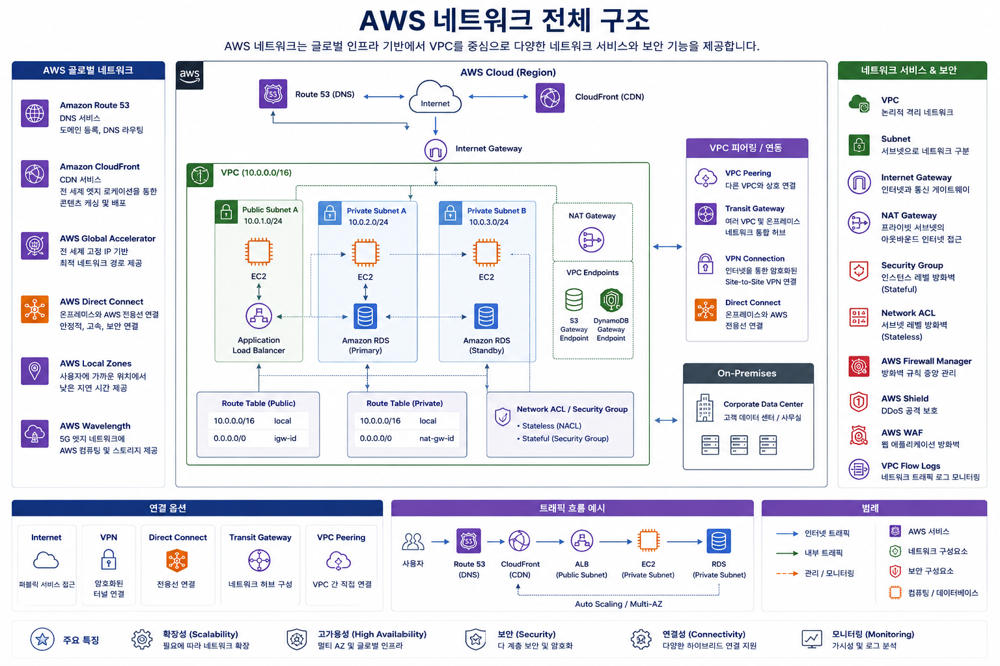

# AWS 클라우드 기술 및 서비스 (네트워크 서비스)

AWS CCP(AWS Certified Cloud Practitioner) 시험에서는 네트워크 서비스가 약 **20~30% 정도** 출제됩니다.

AWS에서는 **"인터넷과 서버를 연결하는 방법"** 정도만 이해하면 충분합니다.

이번 장에서는 아래 서비스를 설명합니다.

* VPC
* Subnet
* Route Table
* Internet Gateway
* NAT Gateway
* Security Group
* NACL
* Route53
* CloudFront

---

# AWS 네트워크 전체 구조



---

# 1. VPC (Virtual Private Cloud)

## VPC란?

VPC는

> **AWS 안에서 사용하는 나만의 가상 네트워크**

입니다.

쉽게 말하면

> AWS에서 회사 전산실 하나를 만드는 것과 같습니다.

---

## 특징

* 자신만 사용하는 네트워크
* IP 대역 지정 가능
* 인터넷 연결 여부 결정
* 여러 Subnet 생성 가능

예)

```
회사 네트워크

192.168.0.0/16

↓

AWS에서는

10.0.0.0/16
```

---

## 비유

아파트 단지

```
아파트 단지 = VPC

단지 안에 여러 동(Subnet)

각 집 = EC2
```

---

## 기억할 내용

> VPC = 가장 큰 네트워크

---

# 2. Subnet

Subnet은

> VPC를 작은 네트워크로 나눈 것

입니다.

예)

```
VPC

10.0.0.0/16

↓

Public

10.0.1.0/24

↓

Private

10.0.2.0/24
```

---

## 왜 나누는가?

보안을 위해

예)

```
Public

Web Server

↓

Private

DB Server
```

DB는 인터넷에서 직접 접근하면 안 됩니다.

---

## Public Subnet

인터넷 접근 가능

사용 예

* Web Server
* Bastion Host
* NAT Gateway
* Load Balancer

---

## Private Subnet

인터넷 직접 접근 불가

사용 예

* Database
* Application Server
* Cache

---

## 기억할 내용

Public = 인터넷 가능

Private = 인터넷 불가능

---

# 3. Route Table

Route Table은

> 목적지까지 가는 길을 알려주는 지도

입니다.

예)

```
목적지

0.0.0.0/0

↓

Internet Gateway
```

의미

```
인터넷으로 가라
```

---

또는

```
0.0.0.0/0

↓

NAT Gateway
```

의미

```
인터넷은 NAT를 통해 나가라
```

---

## 비유

네비게이션

```
서울 → 부산

어느 길로 갈 것인가

↓

Route Table
```

---

# 4. Internet Gateway (IGW)

Internet Gateway는

> VPC와 인터넷을 연결하는 출입문

입니다.

없으면

```
EC2

↓

인터넷

불가능
```

---

## Public Subnet이 되려면

① Internet Gateway 연결

② Route Table에

```
0.0.0.0/0

↓

IGW
```

추가

---

# 5. NAT Gateway

NAT Gateway는

> Private Subnet이 인터넷으로 나갈 수 있게 하는 서비스

입니다.

중요한 특징

**밖에서는 들어올 수 없습니다.**

```
Private EC2

↓

NAT Gateway

↓

Internet
```

가능

```
Internet

↓

Private EC2

X
```

불가능

---

## 사용하는 이유

예)

Private EC2에서

* yum update
* apt update
* Docker pull

해야 하기 때문입니다.

---

## 시험 포인트

Private Subnet

↓

인터넷 나감

↓

NAT Gateway

---

# Public vs Private Subnet

| 구분        | Public | Private |
| ----------- | ------ | ------- |
| 인터넷 접속 | O      | X       |
| IGW 사용    | O      | X       |
| NAT 사용    | X      | O       |
| 웹 서버     | O      | X       |
| DB          | X      | O       |

---

# 6. Security Group

Security Group은

> EC2 앞에 설치하는 방화벽

입니다.

---

## 특징

Stateful

즉

```
요청 허용

↓

응답 자동 허용
```

---

예)

Inbound

```
80

허용
```

사용자가 접속

↓

응답

자동 허용

---

## 설정

Inbound

```
80

443

22
```

Outbound

```
모두 허용
```

기본값

---

## 기억

EC2마다 적용

---

# 7. NACL (Network ACL)

NACL도 방화벽입니다.

하지만

Subnet에 적용됩니다.

```
VPC

↓

Subnet

↓

NACL

↓

EC2
```

---

## 특징

Stateless

즉

들어오는 것

허용

↓

나가는 것

별도 허용

---

## Security Group과 차이

SG

```
허용만 가능

Stateful
```

NACL

```
허용 + 거부 가능

Stateless
```

---

# 8. Route53

Route53은

> AWS의 DNS 서비스

입니다.

DNS란

```
www.naver.com

↓

223.xxx.xxx.xxx
```

IP 주소로 변환하는 서비스입니다.

---

## 주요 기능

* 도메인 등록
* DNS
* Health Check
* Failover
* Routing

---

## 다양한 Routing

### Simple

1개의 서버

---

### Weighted

70%

30%

트래픽 분산

---

### Latency

가장 가까운 Region

---

### Geolocation

국가별 연결

---

### Failover

장애 발생

↓

자동 다른 서버 연결

---

# 9. CloudFront

CloudFront는

> AWS CDN(Content Delivery Network)

입니다.

---

## CDN이란?

전 세계 Edge Location에 콘텐츠를 저장

```
사용자

↓

가까운 Edge

↓

응답
```

속도가 빨라집니다.

---

예)

한국 사용자

↓

서울 Edge

↓

응답

미국 서버까지 가지 않습니다.

---

## 저장 가능한 것

* 이미지
* 동영상
* HTML
* CSS
* JavaScript

---

## 장점

* 빠른 응답
* 비용 절감
* 보안 강화
* DDoS 완화

---

# CloudFront 동작 과정

```text
사용자

↓

Edge Location

↓

캐시 존재

↓

즉시 응답

캐시 없음

↓

Origin(S3/EC2)

↓

Edge 저장

↓

사용자
```

---

# 전체 관계도

```text
                    Internet
                        │
                 Route53(DNS)
                        │
                  CloudFront(CDN)
                        │
                Internet Gateway
                        │
        ┌────────────────────────────┐
        │            VPC             │
        │                            │
        │  Public Subnet             │
        │  ┌──────────────────────┐  │
        │  │ ALB / EC2(Web)       │  │
        │  │ Security Group       │  │
        │  └──────────────────────┘  │
        │          │                 │
        │      NAT Gateway           │
        │          │                 │
        │────────────────────────────│
        │ Private Subnet             │
        │ ┌──────────────────────┐   │
        │ │ EC2(App)             │   │
        │ │ RDS                  │   │
        │ │ Security Group       │   │
        │ └──────────────────────┘   │
        │                            │
        │ NACL(Subnet 보호)          │
        └────────────────────────────┘
```

---

# AWS CCP 시험에서 자주 나오는 비교

## 1. VPC vs Subnet

| 항목       | VPC                  | Subnet                   |
| ---------- | -------------------- | ------------------------ |
| 의미       | 가상 네트워크 전체   | VPC를 나눈 작은 네트워크 |
| 범위       | 가장 큼              | VPC 내부                 |
| CIDR 예    | 10.0.0.0/16          | 10.0.1.0/24              |
| 포함 관계  | 여러 Subnet 포함     | 하나의 VPC에 속함        |
| 목적       | 네트워크 격리        | 리소스 분리 및 보안      |

**핵심:** **VPC는 '단지', Subnet은 '동'**입니다.

---

## 2. Public Subnet vs Private Subnet

| 항목                    | Public                        | Private                      |
| ----------------------- | ----------------------------- | ---------------------------- |
| 인터넷 직접 접근        | O                             | X                            |
| Internet Gateway 사용   | O                             | X (직접 연결 안 함)          |
| NAT Gateway 필요        | X                             | O (아웃바운드만)             |
| 배치 대상               | Web Server, ALB, Bastion Host | App Server, RDS, ElastiCache |
| 보안 수준               | 상대적으로 낮음               | 상대적으로 높음              |

---

## 3. Internet Gateway vs NAT Gateway

| 항목                 | Internet Gateway  | NAT Gateway                             |
| -------------------- | ----------------- | --------------------------------------- |
| 목적                 | 인터넷과 VPC 연결 | Private Subnet의 인터넷 아웃바운드 지원 |
| 설치 위치            | VPC에 연결        | Public Subnet에 생성                    |
| 인터넷에서 접근 가능 | O                 | X                                       |
| 아웃바운드 인터넷    | O                 | O                                       |
| 인바운드 허용        | O                 | X                                       |
| 주요 대상            | Public Subnet     | Private Subnet                          |

**시험 포인트:** **Private Subnet이 인터넷으로 나가야 하면 NAT Gateway를 사용합니다.**

---

## 4. Security Group vs NACL

| 항목         | Security Group                      | NACL                                                  |
| ------------ | ----------------------------------- | ----------------------------------------------------- |
| 적용 대상    | EC2, RDS 등 인스턴스                | Subnet                                                |
| 동작 방식    | Stateful                            | Stateless                                             |
| 허용(Allow)  | O                                   | O                                                     |
| 거부(Deny)   | X                                   | O                                                     |
| 응답 트래픽  | 자동 허용                           | 별도 규칙 필요                                        |
| 기본 설정    | 모든 인바운드 차단, 아웃바운드 허용 | 기본 NACL은 허용, 사용자 정의 NACL은 규칙에 따라 다름 |

* **Security Group = 서버 문 앞 경비원**
* **NACL = 건물 입구 경비원**

---

## 5. Route Table vs Route53

| 항목      | Route Table               | Route53                              |
| --------- | ------------------------- | ------------------------------------ |
| 역할      | 네트워크 패킷의 경로 결정 | 도메인 이름을 IP 주소로 변환(DNS)    |
| 적용 범위 | VPC 내부                  | 인터넷 및 AWS 전역                   |
| 예시      | `0.0.0.0/0 → IGW`         | `www.example.com → 3.35.x.x`         |
| 주요 기능 | 라우팅                    | DNS, 도메인 등록, 트래픽 라우팅 정책 |

---

## 6. Route53 vs CloudFront

| 항목        | Route53                        | CloudFront                       |
| --------    | ------------------------------ | -------------------------------- |
| 역할        | DNS 서비스                     | CDN 서비스                       |
| 목적        | 도메인 연결                    | 콘텐츠를 빠르게 전달             |
| 데이터 저장 | X                              | O(캐시)                          |
| 성능 향상   | 간접적                         | 직접적                           |
| 대표 기능   | 도메인, 헬스 체크, 라우팅 정책 | 캐싱, 전 세계 Edge Location 활용 |

---

# 전체 서비스 한눈에 비교

| 서비스           | 핵심 역할                    | 쉽게 기억하기                    |
| ---------------- | ---------------------------- | -------------------------------- |
| VPC              | AWS 내 가상 네트워크         | 아파트 단지                      |
| Subnet           | VPC를 나눈 네트워크          | 아파트 동                        |
| Route Table      | 네트워크 경로 설정           | 내비게이션                       |
| Internet Gateway | 인터넷 출입문                | 단지 정문                        |
| NAT Gateway      | Private Subnet의 인터넷 출구 | 외출 전용 문(들어오는 것은 불가) |
| Security Group   | 인스턴스 방화벽              | 집 현관문                        |
| NACL             | Subnet 방화벽                | 아파트 출입구                    |
| Route53          | DNS 서비스                   | 전화번호부(도메인 → IP)          |
| CloudFront       | CDN 서비스                   | 가까운 물류창고(캐시)            |

# AWS CCP 시험 핵심 암기 포인트

1. **VPC는 가장 큰 네트워크이고, Subnet은 VPC를 나눈 작은 네트워크이다.**
2. **Public Subnet은 Internet Gateway를 통해 인터넷과 직접 통신한다.**
3. **Private Subnet은 Internet Gateway로 직접 나갈 수 없으며, NAT Gateway를 통해서만 아웃바운드 인터넷 통신이 가능하다.**
4. **Route Table은 패킷의 이동 경로를 결정한다.**
5. **Security Group은 인스턴스 단위의 Stateful 방화벽이며 Allow 규칙만 설정할 수 있다.**
6. **NACL은 Subnet 단위의 Stateless 방화벽이며 Allow와 Deny를 모두 설정할 수 있다.**
7. **Route53은 DNS 서비스이고, CloudFront는 콘텐츠를 캐싱하여 전송 속도를 높이는 CDN 서비스이다.**

이 정도 수준의 개념과 비교를 이해하면 AWS CCP 시험에서 출제되는 네트워크 관련 문제의 대부분을 해결할 수 있습니다.
