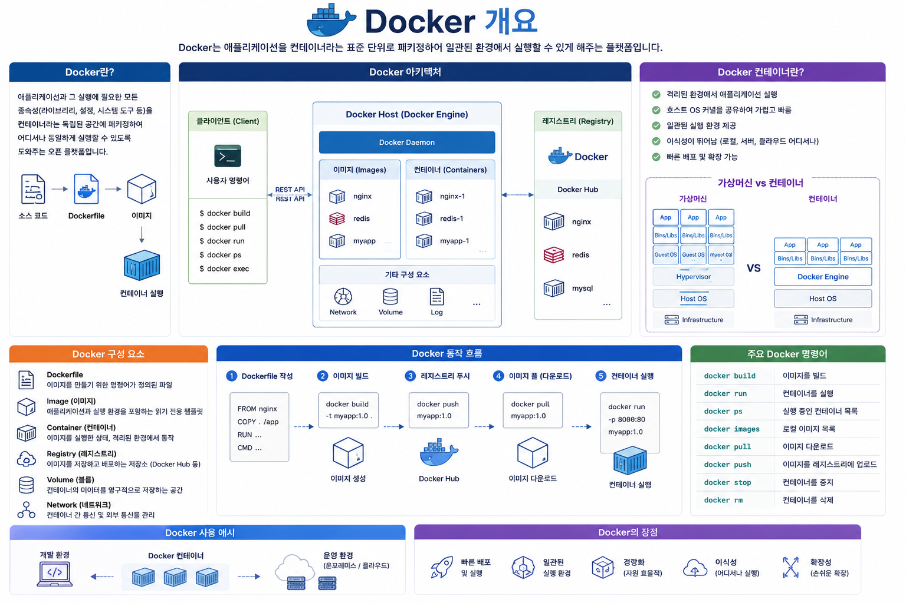
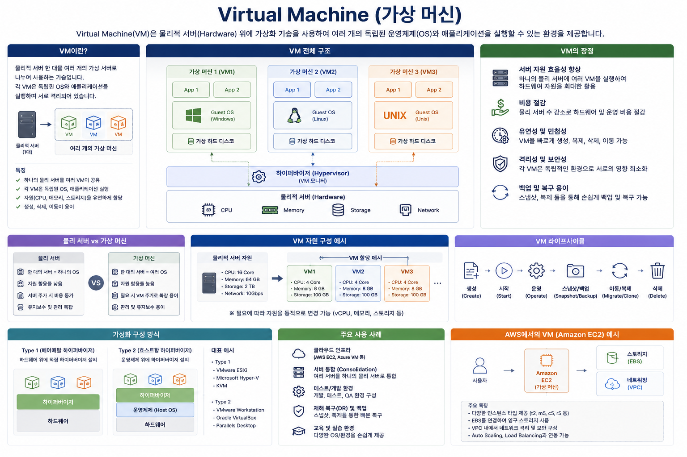
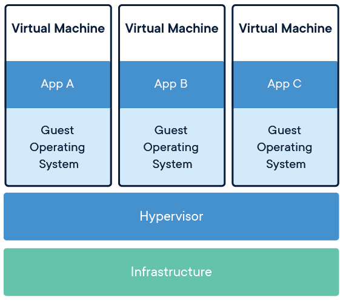
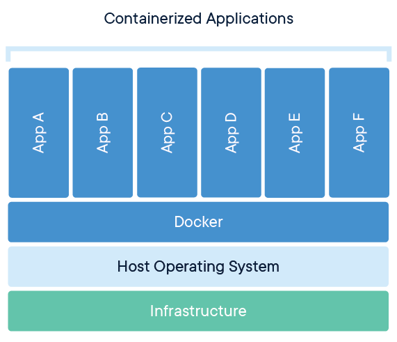
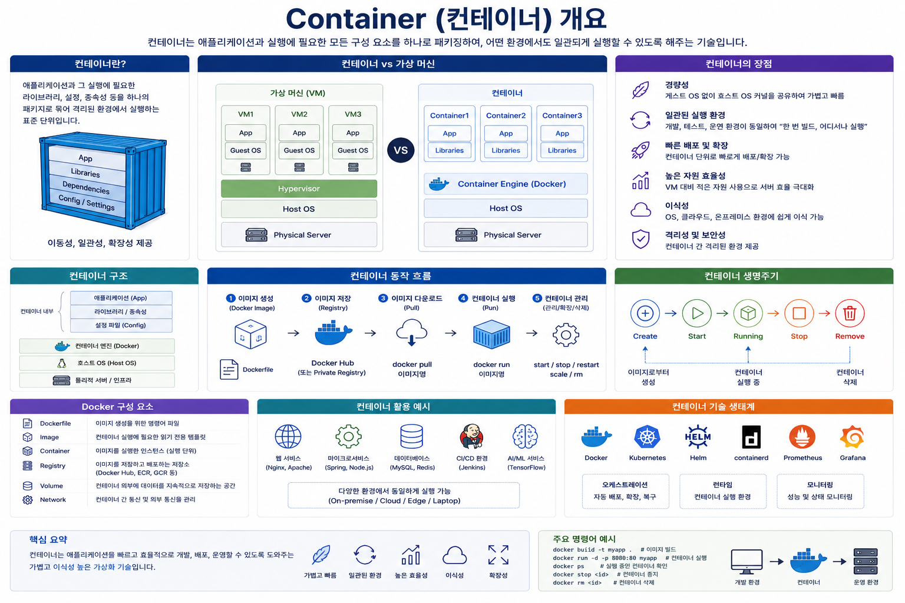
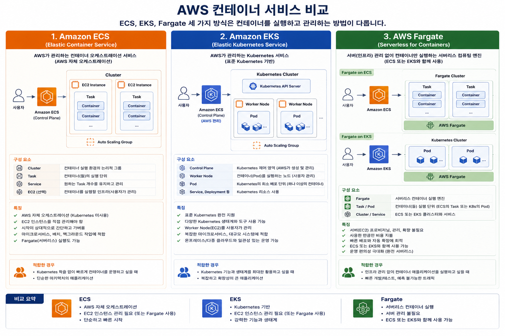

# Docker와 Container란?



AWS CCP를 처음 준비하는 학생들이 가장 많이 헷갈리는 부분이 바로 **Docker**와 **Container**입니다.

먼저 결론부터 이야기하면,

> **Container는 실행되는 프로그램(실행 환경)이고, Docker는 그 Container를 만들고 실행하는 도구입니다.**

쉽게 말하면,

* **Container = 자동차**
* **Docker = 자동차를 만드는 공장 + 운전하는 시스템**

입니다.

---

# 왜 Docker가 등장했을까?

예전에는 프로그램을 배포할 때 이런 문제가 있었습니다.

예를 들어 Java 웹 애플리케이션을 개발했다고 가정해 보겠습니다.

```
내 PC

Windows
JDK 17
Tomcat 10
MySQL

↓

개발 완료
```

이제 서버에 배포합니다.

```
Linux

JDK 없음

Tomcat 버전 다름

라이브러리 다름
```

결과는?

```
내 컴퓨터에서는 잘 되는데요...
```

라는 유명한 문제가 발생합니다.

즉,

프로그램보다 **실행 환경(Environment)** 이 더 큰 문제였습니다.

---

# Virtual Machine(VM)의 등장



이를 해결하기 위해 가상머신(VM)을 사용했습니다.

```
물리 서버
─────────────────────────
Hypervisor
─────────────────────────
VM1 (Windows)
VM2 (Linux)
VM3 (Ubuntu)
```

VM은 운영체제(OS)까지 포함합니다.

예를 들어

```
Ubuntu VM

Ubuntu OS

Java

Tomcat

Application
```

### 장점

* 환경이 동일하다.
* 다른 운영체제도 실행 가능하다.

### 단점

* OS까지 포함하므로 용량이 매우 크다.
* 부팅 시간이 오래 걸린다.
* 메모리를 많이 사용한다.

---

# Container의 등장

Container는

> **운영체제를 따로 포함하지 않습니다.**

Host OS를 함께 사용합니다.

```
Host OS (Linux)

──────────────────────

Container1

Java

Application

──────────────────────

Container2

Python

Application

──────────────────────

Container3

Nginx
```

모든 Container가 하나의 OS를 공유합니다.

그래서

* 매우 가볍고
* 매우 빠르고
* 수백 개도 쉽게 실행 가능합니다.

---

# VM과 Container 비교

VM 예시 



---





---

# Container란?



Container는

> **프로그램과 실행에 필요한 모든 것을 하나로 묶어놓은 독립된 실행 환경**

입니다.

예를 들어

```
웹 서버

Python

Flask

Library

환경설정

모두 하나
```

이 하나의 Container가 됩니다.

Container는

```
삭제

복사

이동

재생성
```

이 매우 쉽습니다.

---

# Docker란?

Docker는

> **Container를 생성하고 실행하고 관리하는 플랫폼**

입니다.

Docker가 하는 일

```
Image 다운로드

↓

Container 생성

↓

실행

↓

중지

↓

삭제
```

---

# Docker 구성

```
Docker
│
├── Image
├── Container
└── Registry(Docker Hub)
```
---

## ① Docker Image

Image는

> **Container의 설계도**

입니다.

예)

```
Ubuntu Image

Python Image

Nginx Image

MySQL Image
```

Image는 변경되지 않습니다.

읽기 전용(Read Only)입니다.

---

## ② Docker Container

Container는 Image를 실행한 결과입니다.

예)

```
Python Image

↓

실행

↓

Python Container
```

Image 하나로

```
Container 1

Container 2

Container 3
```

여러 개를 만들 수 있습니다.

---

## ③ Docker Hub

Docker Hub는

> Docker Image 저장소입니다.

예를 들어

```
docker pull nginx
```

를 실행하면

Docker Hub에서

```
Nginx Image
```

를 다운로드합니다.

---

# Image와 Container 관계

```
Docker Hub

↓

Ubuntu Image

↓

Docker

↓

Container 실행
```

또는

```
MySQL Image

↓

Container 실행

↓

MySQL 서버
```

---

# 실제 예제

웹 서버 하나 실행

```
docker run nginx
```

Docker가 내부적으로 수행하는 작업

```
① nginx Image 확인

↓

② 없으면 Docker Hub에서 다운로드

↓

③ Container 생성

↓

④ 실행
```

사용자는 명령어 한 줄만 입력하면 됩니다.

---

# Container의 특징

### ① 빠른 실행

VM

```
부팅 : 수십 초~수 분
```

Container

```
실행 : 수 초 이내
```

---

### ② 가볍다

VM

```
OS 포함

수 GB
```

Container

```
OS 제외

수십~수백 MB
```

---

### ③ 이식성

Windows에서 만든 Container를

Linux에서도 실행 가능합니다.

(단, 일반적으로 Linux Container는 Linux 커널 기반에서 실행되며, Windows에서는 Docker Desktop이나 WSL2 등을 통해 실행됩니다.)

---

### ④ 독립성

Container마다

```
Python 3.9

Python 3.12
```

처럼 서로 다른 버전을 동시에 사용할 수 있습니다.

---

# Docker를 사용하는 이유

예를 들어 쇼핑몰 서비스를 만든다고 가정합니다.

```
쇼핑몰

↓

Web Server

↓

Application

↓

Database
```

이를 Docker로 구성하면

```
Container 1

Nginx

----------------

Container 2

Spring Boot

----------------

Container 3

MySQL
```

각 서비스를 독립적으로 관리할 수 있습니다.

---

# AWS에서는 어떻게 사용할까?

AWS에서는 Docker Container를 다음과 같은 서비스에서 실행할 수 있습니다.

| 서비스  | 설명                                                      |
| ------- | --------------------------------------------------------- |
| ECS     | AWS의 자체 컨테이너 오케스트레이션 서비스                 |
| EKS     | Kubernetes 기반 컨테이너 관리 서비스                      |
| Fargate | EC2 서버 관리 없이 컨테이너를 실행하는 서버리스 실행 환경 |
| EC2     | Docker Engine을 직접 설치하여 컨테이너 실행               |



예를 들어,

```
사용자

↓

API Gateway

↓

ECS

↓

Fargate

↓

Docker Container

↓

Spring Boot
```

이처럼 AWS에서는 **Docker 컨테이너를 ECS 또는 EKS에서 관리**하고, **Fargate를 이용해 서버를 직접 관리하지 않고 실행**할 수 있습니다.

---

# Docker와 Container의 관계

```
Docker Hub
     │
     ▼
+------------------+
| Docker Image     |  ← 설계도
+------------------+
          │
          ▼
+------------------+
| Docker Engine    |  ← 생성 및 실행
+------------------+
          │
          ▼
+------------------+
| Container        |  ← 실제 실행 중인 애플리케이션
+------------------+
```

---

# 시험 핵심 비교

| 항목            | Docker                                          | Container                              |
| --------------- | ----------------------------------------------- | -------------------------------------- |
| 의미            | 컨테이너를 생성·실행·관리하는 플랫폼            | 애플리케이션이 실행되는 독립된 환경    |
| 역할            | Image 관리, Container 생성 및 실행              | 실제 프로그램 실행                     |
| 비유            | 공장 + 관리자                                   | 완성된 자동차                          |
| 포함 내용       | Docker Engine, Image 관리, Registry 연동        | 애플리케이션, 라이브러리, 설정         |
| AWS 연관 서비스 | ECS, EKS, Fargate에서 Docker 기반 컨테이너 실행 | ECS/EKS/Fargate에서 실제 실행되는 단위 |

---

# AWS CCP 시험 핵심 암기 포인트

* **Container**: 애플리케이션과 실행에 필요한 모든 요소를 하나로 묶은 **독립적인 실행 환경**이다.
* **Docker**: 컨테이너를 **생성(Create), 실행(Run), 관리(Manage)** 하는 가장 널리 사용되는 플랫폼이다.
* **Image**: 컨테이너를 만들기 위한 **설계도(템플릿)** 이다.
* **Container = Image를 실행한 결과**이다.
* **ECS/EKS는 컨테이너를 관리하는 서비스**이고, **Fargate는 컨테이너를 실행하는 서버리스 실행 환경**이다.

### 한 줄로 기억하기

> **Image는 설계도, Docker는 관리자, Container는 실제 실행되는 프로그램이다.**

