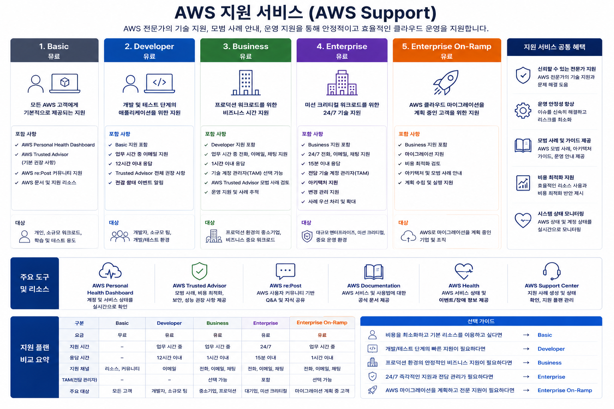

# AWS CCP 비용 관리 및 지원 서비스

---

# 학습 목표

이번 장에서는 다음 내용을 이해하는 것이 목표입니다.

* AWS Support Plan(지원 서비스)의 종류
* Basic / Developer / Business / Enterprise Support의 차이
* Trusted Advisor가 무엇인지
* 시험에서 자주 출제되는 포인트
* 지원 서비스 비교

---

# 1. AWS 지원 서비스(AWS Support)



AWS는 클라우드 서비스를 사용하는 고객이 문제를 해결하거나 시스템을 안정적으로 운영할 수 있도록 여러 단계의 지원 서비스를 제공합니다.

쉽게 말하면

> **"AWS를 사용할 때 문제가 생기면 어느 정도까지 AWS 전문가가 도와주는가?"**

를 결정하는 서비스입니다.

---

## 왜 필요한가?

예를 들어

* EC2가 실행되지 않는다.
* RDS가 연결되지 않는다.
* 비용이 갑자기 증가했다.
* 서버 장애가 발생했다.

이런 상황에서 AWS 엔지니어의 도움을 받을 수 있습니다.

지원 수준에 따라

* 이메일 지원
* 채팅 지원
* 전화 지원
* 24시간 지원
* 전담 기술 관리자(TAM)

등이 달라집니다.

---

# AWS Support 구조

```
Enterprise
      ▲
Business
      ▲
Developer
      ▲
Basic
```

위로 올라갈수록

* 지원 범위 증가
* 응답 속도 증가
* 비용 증가

---

# 2. Basic Support

가장 기본으로 제공되는 무료 지원 서비스입니다.

AWS 계정을 만들면 자동으로 제공됩니다.

## 특징

* 무료
* AWS Documentation 이용 가능
* AWS Whitepaper
* AWS Knowledge Center
* Billing 문의 가능
* Service Health Dashboard 이용 가능

즉,

기술적인 질문은 거의 지원하지 않습니다.

---

## 지원 내용

가능한 것

* 계정 생성
* 과금 문의
* AWS 문서 이용
* 서비스 상태 확인

불가능한 것

* EC2 오류 해결
* VPC 설정 문의
* RDS 장애 지원

---

## 언제 사용?

개인 공부

학생

AWS CCP 학습

간단한 실습

---

# 3. Developer Support

개발자를 위한 지원 서비스입니다.

프로그램을 개발하면서 발생하는 문제를 지원합니다.

---

## 특징

* 유료
* 이메일 지원
* 업무 시간 지원
* 기술 문의 가능
* 일반적인 개발 환경 지원

---

예를 들어

"Lambda가 실행되지 않습니다."

"API Gateway 오류가 발생합니다."

같은 질문이 가능합니다.

---

## 응답 시간

일반적으로

중요도가 높은 문제

→ 수 시간 내 응답

---

## 적합한 대상

* 개발자
* 스타트업
* 소규모 프로젝트

---

# 4. Business Support

기업 운영을 위한 지원 서비스입니다.

CCP 시험에서 매우 자주 등장합니다.

---

## 특징

* 24시간 지원
* 전화 지원
* 이메일
* 채팅 지원
* 빠른 응답
* Trusted Advisor 전체 기능 제공

---

Business Support부터

AWS 전문가에게 언제든 문의할 수 있습니다.

---

## 예시

새벽 2시에

EC2 장애 발생

↓

전화 지원

↓

AWS 엔지니어 대응

---

## 응답 시간

가장 심각한 장애

→ 1시간 이내

---

## 적합한 대상

중소기업

서비스 운영

쇼핑몰

웹 서비스

---

# 5. Enterprise Support

가장 높은 수준의 지원입니다.

대기업이나 금융권에서 많이 사용합니다.

---

## 특징

* TAM(Technical Account Manager)
* 가장 빠른 응답
* 설계 컨설팅
* 운영 컨설팅
* 비용 최적화 지원
* 아키텍처 리뷰
* Well-Architected Review 지원

---

## TAM이란?

Technical Account Manager

전담 AWS 전문가입니다.

회사의 AWS 운영을 지속적으로 지원합니다.

예를 들어

> "다음 달 이벤트로 트래픽이 10배 증가합니다."

↓

TAM

↓

사전 점검

↓

Auto Scaling 확인

↓

비용 분석

↓

장애 예방

---

## 응답 시간

가장 심각한 장애

→ **15분 이내**

---

## 적합한 대상

* 금융권
* 대기업
* 대규모 서비스
* 24시간 운영 서비스

---

# Support Plan 비교

| 항목            | Basic | Developer | Business | Enterprise      |
| --------------- | ----- | --------- | -------- | --------------- |
| 비용            | 무료  | 유료      | 유료     | 유료(가장 비쌈) |
| 기술 지원       | ❌   | ✅       | ✅      | ✅              |
| 이메일          | ❌   | ✅       | ✅      | ✅              |
| 채팅            | ❌   | ❌       | ✅      | ✅              |
| 전화            | ❌   | ❌       | ✅      | ✅              |
| 24시간 지원     | ❌   | ❌       | ✅      | ✅              |
| TAM             | ❌   | ❌       | ❌      | ✅              |
| Trusted Advisor | 일부  | 일부      | 전체     | 전체            |

---

# 6. Trusted Advisor

AWS 계정을 분석하여

문제점을 찾아주고

개선 방법을 추천하는 서비스입니다.

쉽게 말하면

> **AWS 건강검진 서비스**

라고 생각하면 됩니다.

---

## 무엇을 검사할까?

AWS 환경을 분석하여

* 비용 절감
* 보안
* 성능
* 장애 대비
* 서비스 제한

등을 점검합니다.

---

## 5가지 핵심 검사 영역

### ① Cost Optimization

비용 절감

예시

* 사용하지 않는 EC2
* 사용하지 않는 EBS
* Idle Load Balancer

↓

삭제 추천

---

### ② Security

보안 점검

예시

* MFA 미사용
* 보안 그룹 개방
* IAM 보안 문제

↓

수정 추천

---

### ③ Performance

성능 향상

예시

* 과부하 EC2
* CloudFront 사용 추천
* 성능 개선 방법

---

### ④ Fault Tolerance

장애 대비

예시

* Multi-AZ 미사용
* 백업 없음
* Auto Scaling 미설정

---

### ⑤ Service Limits(Quotas)

서비스 한도 확인

예시

EC2 생성 가능 개수

VPC 개수

EIP 개수

등을 확인합니다.

---

# Trusted Advisor 예시

현재 상태

```
EC2 15대 운영

↓

5대 사용률 1%

↓

Trusted Advisor

↓

삭제 추천

↓

비용 절감
```

---

# Support와 Trusted Advisor 관계

```
AWS Support

     │
     ├── Basic
     │
     ├── Developer
     │
     ├── Business
     │      │
     │      └── Trusted Advisor 전체 기능
     │
     └── Enterprise
            │
            ├── TAM
            ├── Trusted Advisor
            └── 컨설팅
```

---

# 시험에서 자주 나오는 문제

### 문제 1

무료 지원 서비스는?

✅ Basic

---

### 문제 2

24시간 전화 지원은?

✅ Business 이상

---

### 문제 3

전담 기술 관리자(TAM)를 제공하는 것은?

✅ Enterprise

---

### 문제 4

AWS 환경을 분석하여 비용 절감과 보안 개선을 추천하는 서비스는?

✅ Trusted Advisor

---

### 문제 5

Trusted Advisor가 점검하는 항목이 아닌 것은?

예시 보기

* 비용
* 보안
* 성능
* 장애 대비
* **애플리케이션 소스코드 품질**

정답

✅ 애플리케이션 소스코드 품질

---

# 최종 비교

## ① Support Plan 비교

| 구분            | Basic          | Developer       | Business  | Enterprise |
| --------------- | --------       | ---------       | --------- | ---------- |
| 비용            | 무료           | 유료            | 유료      | 유료(최고) |
| 대상            | 개인, 학생     | 개발자          | 기업      | 대기업     |
| 기술 지원       | ❌            | ✅              | ✅       | ✅        |
| 이메일          | ❌            | ✅              | ✅       | ✅        |
| 채팅            | ❌            | ❌              | ✅       | ✅        |
| 전화            | ❌            | ❌              | ✅       | ✅        |
| 24×7 지원       | ❌            | ❌              | ✅       | ✅        |
| TAM             | ❌            | ❌              | ❌       | ✅        |
| 아키텍처 리뷰   | ❌            | ❌              | 일부 지원 | ✅        |
| Trusted Advisor | 핵심 검사 일부 | 핵심 검사 일부  | 전체 검사  | 전체 검사 |

> **CCP 시험 포인트:** 현재는 **Basic과 Developer는 Trusted Advisor의 핵심(Core) 검사만 제공**하며, **Business와 Enterprise는 전체 검사 및 권장 사항**을 사용할 수 있습니다.

---

## ② Support Plan 선택 기준

| 상황                               | 추천 Support Plan | 이유                                   |
| ---------------------------------- | ----------------- | ------------------------------------ |
| AWS를 처음 배우는 학생             | Basic             | 무료로 문서와 과금 지원을 이용 가능                 |
| 개인 개발 및 테스트                | Developer         | 기술 문의를 할 수 있음                        |
| 실제 서비스를 운영하는 기업        | Business          | 24시간 기술 지원과 전체 Trusted Advisor 기능 제공 |
| 금융권·대기업·미션 크리티컬 서비스 | Enterprise        | TAM, 가장 빠른 응답, 운영 및 아키텍처 컨설팅 제공      |

---

## ③ 시험 핵심 암기표

| 키워드              | 반드시 기억할 내용                                                  |
| ------------------- | ------------------------------------------------------------------- |
| **Basic**           | 무료, 기술 지원 없음, 문서·과금 지원                                |
| **Developer**       | 개발자를 위한 기술 지원, 이메일 중심                                |
| **Business**        | 24×7 전화·채팅·이메일 지원, Trusted Advisor 전체 기능               |
| **Enterprise**      | TAM 제공, 15분 이내(심각한 장애) 응답 목표, 최고 수준의 운영 지원   |
| **Trusted Advisor** | 비용 최적화, 보안, 성능, 장애 허용성(Fault Tolerance), 서비스 할당량(Service Quotas) 점검 |

## CCP 시험에서 꼭 기억할 핵심

1. **Basic Support는 무료이며 모든 AWS 계정에 기본 제공됩니다.**
2. **Business Support부터 24시간 전화 및 채팅 기술 지원을 받을 수 있습니다.**
3. **Enterprise Support만 TAM(Technical Account Manager)을 제공합니다.**
4. **Trusted Advisor는 AWS 환경을 분석하여 비용, 보안, 성능, 장애 허용성, 서비스 한도를 점검하고 개선 사항을 추천합니다.**
5. **Business와 Enterprise는 Trusted Advisor의 전체 기능을 사용할 수 있으며, Basic과 Developer는 핵심(Core) 검사만 사용할 수 있습니다.**

이 다섯 가지는 AWS CCP 시험에서 가장 자주 출제되는 지원 서비스 관련 핵심 내용입니다.
